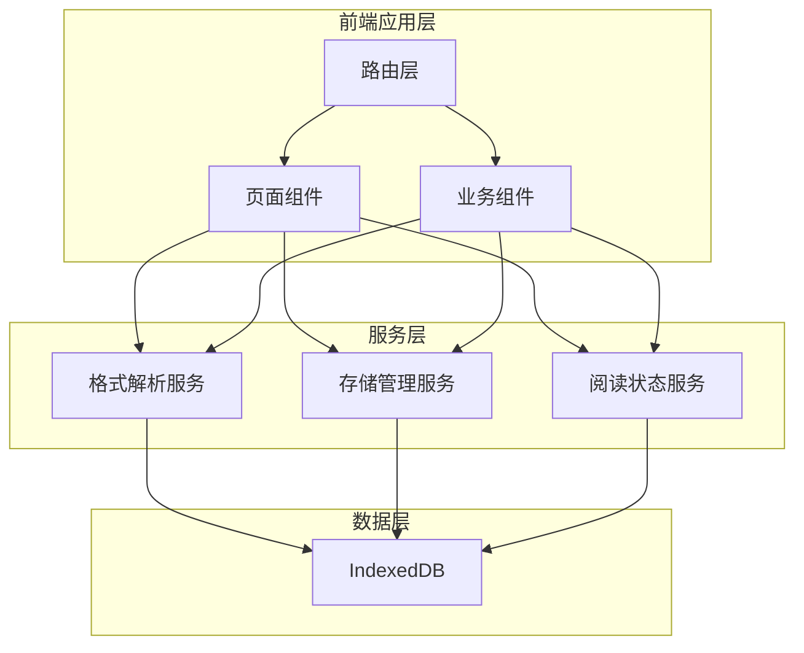

# 电子书阅读器技术设计

Feature Name: ebook-reader
Updated: 2026-05-13

## Description

纯前端单机版电子书阅读器，支持 TXT、PDF、EPUB、MOBI、DOCX、Markdown 格式的上传、管理和阅读。所有数据存储在浏览器 IndexedDB 中，后续通过 Electron 打包为桌面应用。

## Architecture



### 技术栈

| 层级 | 技术选型 | 说明 |
|------|---------|------|
| 框架 | Vue 3 + TypeScript | 组合式 API，类型安全 |
| 构建工具 | Vite | 快速开发和构建 |
| UI 组件库 | Element Plus 或自定义组件 | 轻量优先 |
| 路由 | Vue Router | 单页应用路由 |
| 状态管理 | Pinia | 轻量状态管理 |
| IndexedDB 封装 | idb 或 Dexie | 简化数据库操作 |
| 格式解析库 | 见下方解析服务章节 | 各格式专用库 |

## Components and Interfaces

### 路由结构

```
/                  -> 书库页面 (LibraryView)
/book/:id          -> 阅读页面 (ReaderView)
/settings          -> 设置页面 (SettingsView) - 可选
```

### 页面组件

#### LibraryView (书库页面)

- **功能**: 展示所有已导入的电子书列表/网格
- **组件构成**:
  - `BookGrid` / `BookList` - 书籍展示组件
  - `BookCard` - 单本书的卡片组件
  - `UploadButton` - 文件上传触发器
  - `SearchBar` - 搜索框组件

#### ReaderView (阅读页面)

- **功能**: 渲染电子书内容并提供阅读交互
- **组件构成**:
  - `ReaderCore` - 核心渲染组件，根据格式选择对应渲染器
  - `Pagination` - 分页控制组件
  - `ReaderToolbar` - 工具栏（字体、主题、书签、笔记）
  - `ReaderSidebar` - 侧边栏（书签列表、笔记列表、目录）
  - `TextSelector` - 文本选择交互组件

### 业务组件

#### BookCard

- 显示封面、标题、作者、文件大小、最后阅读时间
- 点击跳转到阅读页面
- 提供删除、导出等操作菜单

#### UploadButton

- 触发文件选择器
- 支持拖拽上传
- 文件格式校验
- 上传进度反馈

#### ReaderCore

- 根据电子书格式选择对应的渲染器
- 处理分页逻辑
- 支持字体大小、主题切换
- 处理文本选择和标注

### 服务层

#### FormatParserService (格式解析服务)

负责将各种格式的电子书解析为统一的内部结构。

```typescript
interface ParsedBook {
  id: string;
  title: string;
  author: string;
  cover: ArrayBuffer | null;
  content: Chapter[];
  toc: TOCEntry[];
  metadata: Record<string, string>;
}

interface Chapter {
  id: string;
  title: string;
  content: string; // HTML 片段
}

interface TOCEntry {
  title: string;
  chapterId: string;
  position: number;
}
```

各格式解析策略：

| 格式 | 解析库 | 说明 |
|------|--------|------|
| TXT | 内置 | 按段落分割，纯文本转 HTML |
| Markdown | marked 或 markdown-it | 渲染为 HTML |
| EPUB | epub.js | 标准 EPUB 解析 |
| PDF | pdf.js | Mozilla PDF 渲染引擎 |
| MOBI | 自定义解析 | 参考 mobi 格式规范 |
| DOCX | mammoth.js | 转换为 HTML |

#### StorageService (存储管理服务)

封装 IndexedDB 操作，提供统一的 CRUD 接口。

```typescript
interface BookRecord {
  id: string;
  title: string;
  author: string;
  format: string;
  fileSize: number;
  cover: ArrayBuffer | null;
  rawFile: ArrayBuffer;
  createdAt: number;
  updatedAt: number;
}

interface BookmarkRecord {
  id: string;
  bookId: string;
  chapterId: string;
  position: number;
  title: string;
  createdAt: number;
}

interface NoteRecord {
  id: string;
  bookId: string;
  chapterId: string;
  position: number;
  selectedText: string;
  note: string;
  highlightColor: string;
  createdAt: number;
  updatedAt: number;
}

interface ProgressRecord {
  bookId: string;
  chapterId: string;
  position: number;
  percentage: number;
  updatedAt: number;
}
```

数据库表结构：

```
IndexedDB: EbookReaderDB
├── books          (主键: id)
├── parsedBooks    (主键: bookId, 存储解析后的内容)
├── bookmarks      (主键: id, 索引: bookId)
├── notes          (主键: id, 索引: bookId)
└── progress       (主键: bookId)
```

#### ReaderStateService (阅读状态服务)

管理阅读过程中的状态。

- 当前章节和位置
- 字体大小和主题设置
- 侧边栏展开状态
- 书签和笔记的增删改查

### 数据流

```
用户上传文件
  -> FormatParserService.parse(file)
  -> 返回 ParsedBook
  -> StorageService.saveBook(bookRecord)
  -> StorageService.saveParsedBook(parsedBook)
  -> 更新书库列表

用户打开书籍
  -> StorageService.getBook(id)
  -> StorageService.getProgress(id)
  -> ReaderView 渲染
  -> 跳转到上次阅读位置

用户添加书签/笔记
  -> ReaderStateService 处理交互
  -> StorageService.saveBookmark/Note
  -> 更新侧边栏列表
```

## Data Models

### IndexedDB Schema

使用 Dexie 定义数据库结构：

```typescript
const db = new Dexie('EbookReaderDB');
db.version(1).stores({
  books: 'id, title, format, updatedAt',
  parsedBooks: 'bookId',
  bookmarks: '++id, bookId, chapterId, createdAt',
  notes: '++id, bookId, chapterId, selectedText, createdAt',
  progress: 'bookId',
  settings: 'key'
});
```

### 设置数据模型

```typescript
interface ReaderSettings {
  fontSize: number;        // 字号档位 1-5
  theme: 'light' | 'dark' | 'green';
  fontFamily: string;
  lineHeight: number;
  margin: number;
}
```

## Correctness Properties

- **数据一致性**: 删除书籍时，必须级联删除该书的所有书签、笔记和进度记录
- **唯一性约束**: 同一本书（相同文件名+大小）不应重复导入
- **进度准确性**: 阅读进度必须准确反映用户在书中的位置，百分比计算基于总章节数和段落数
- **解析完整性**: 所有支持的格式必须能够正确解析并渲染，解析失败必须有明确的错误提示

## Error Handling

| 错误场景 | 处理策略 |
|---------|---------|
| 文件格式不支持 | 弹窗提示"不支持的文件格式"，列出支持的格式 |
| 文件解析失败 | 显示解析错误详情，提供重试选项 |
| 文件过大超出存储限制 | 提示用户文件过大，建议拆分或清理存储空间 |
| IndexedDB 写入失败 | 捕获异常，提示用户检查浏览器存储空间 |
| 书籍数据损坏 | 提供"重新解析"选项，从原始文件重新解析 |
| 未找到书籍 | 显示空书库引导页，提示用户上传书籍 |

## Test Strategy

### 单元测试

- FormatParserService: 各格式解析函数的输入输出测试
- StorageService: CRUD 操作测试，级联删除测试
- 工具函数: 进度计算、格式校验等纯函数测试

### 组件测试

- BookCard: 渲染和点击跳转测试
- ReaderCore: 不同格式的渲染测试
- UploadButton: 文件选择和拖拽测试

### 集成测试

- 完整导入流程: 上传 -> 解析 -> 存储 -> 显示
- 完整阅读流程: 打开 -> 阅读 -> 添加书签/笔记 -> 关闭 -> 重新打开
- 删除流程: 删除书籍 -> 验证关联数据清除

### 手动测试

- 各格式真实电子书的渲染效果
- 大文件（>50MB）的性能表现
- 不同浏览器兼容性（Chrome、Edge、Firefox）

## Desktop App Packaging

使用 Electron 打包为桌面应用：

- 复用 Web 端代码
- 使用 Electron 的 `app.getPath('userData')` 替代 IndexedDB 存储
- 配置 electron-builder 输出 .exe
- 处理文件系统直接读写（可选优化）

## References

[^1]: (Vue 3 文档) - https://vuejs.org/guide/introduction.html
[^2]: (Dexie.js 文档) - https://dexie.org/docs/
[^3]: (epub.js 文档) - https://github.com/futurepress/epub.js
[^4]: (pdf.js 文档) - https://mozilla.github.io/pdf.js/
[^5]: (mammoth.js 文档) - https://github.com/mwilliamson/mammoth.js
[^6]: (marked 文档) - https://marked.js.org/
[^7]: (Electron 文档) - https://www.electronjs.org/docs/latest/
