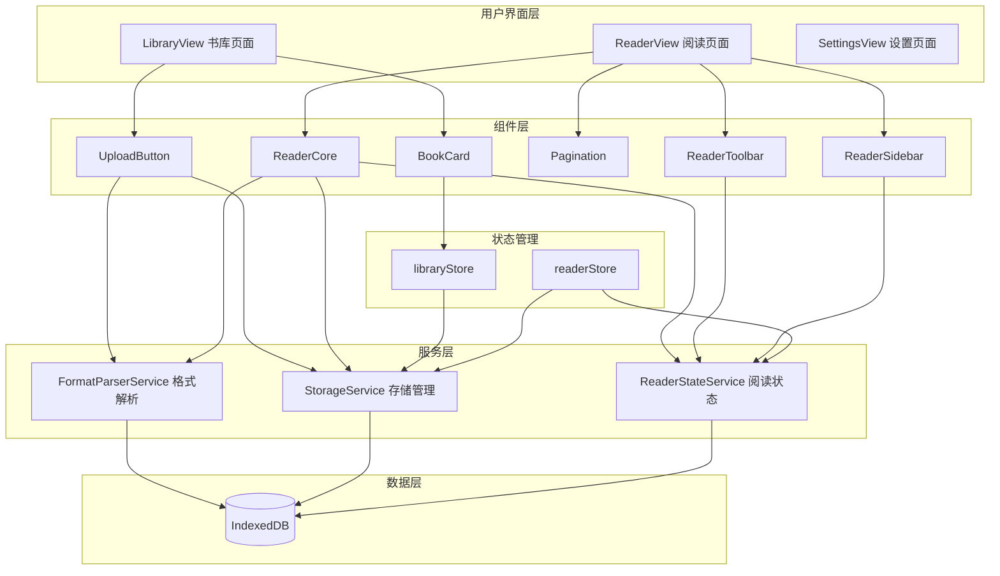
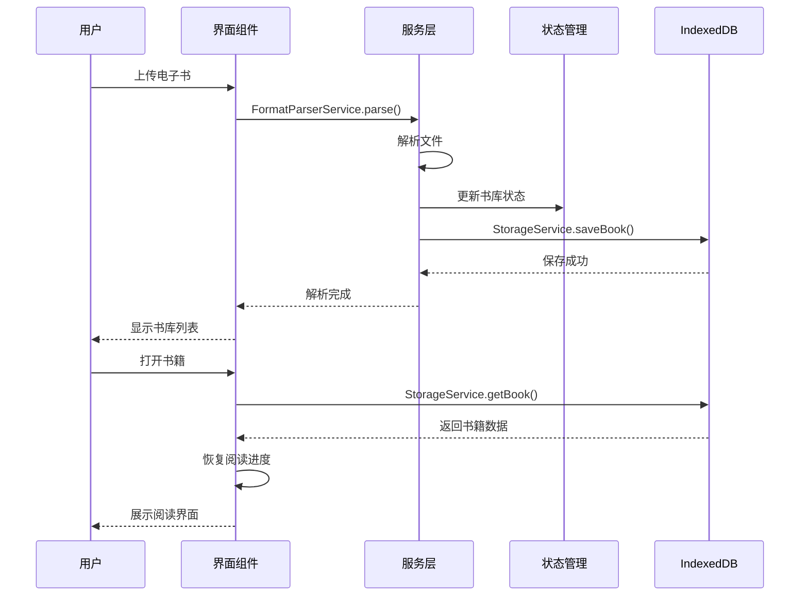

# 电子书阅读器 (QReader)

<div align="center">


一款基于 Web 的单机版电子书阅读器，支持多种格式的电子书导入、管理和阅读。


[在线预览](#在线预览) • [功能特性](#功能特性) • [技术栈](#技术栈) • [快速开始](#快速开始) • [项目结构](#项目结构) • [开发指南](#开发指南)

</div>

---

## 📖 项目简介

电子书阅读器是一款纯前端单机版阅读应用，支持 **TXT、PDF、EPUB、MOBI、DOCX、Markdown** 等多种格式的电子书。所有数据存储在浏览器 OPFS (Origin Private File System) 中，不支持 OPFS 的浏览器自动降级到 IndexedDB。无需后端服务，保护用户隐私。后续可通过 Electron 打包为桌面应用。注：由于本人还在攻读硕士学位，平常没有太多时间，打包工作可能没有太多时间做，但是代码会持续更新，如果觉得有用，大家直接拿去用就行了。

### 核心优势

- **完全离线**: 所有数据本地存储，无需联网
- **多格式支持**: 覆盖主流电子书格式
- **功能完整**: 书签、笔记、高亮、进度管理
- **轻量快速**: 基于 Vite 构建，启动秒开
- **可扩展**: 支持后续打包为桌面应用

---

## ✨ 功能特性

### 📚 书库管理
- 上传本地电子书文件
- 以网格/列表形式展示所有书籍
- 显示书籍封面、标题、作者、文件大小、阅读时间
- 支持删除书籍（级联删除书签和笔记）

### 📖 阅读体验
- 多格式统一渲染
- 翻页导航（上一页/下一页）
- 阅读进度显示（百分比/页码）
- 响应式布局，自适应窗口大小

### ⚙️ 个性化设置
- **字体调节**: 5 档字号切换
- **主题切换**: 白天/夜间/护眼模式
- **阅读设置**: 行间距、页边距、字体选择

### 🔖 书签管理
- 任意位置添加书签
- 书签列表快速跳转
- 书签标题自定义

### 📝 笔记标注
- 选中文本添加笔记
- 文本高亮标记
- 笔记列表管理
- 点击笔记跳转原文

### 🖊️ PDF 标注
- 画笔标注（6 色可选，0.5-10mm 笔触粗细）
- 线条擦除：鼠标划过标注线条即擦除
- 圈套擦除：画圈选区，圈内标注一键清除
- 标注数据本地持久化（LocalStorage）
- 收起工具栏后标注仍可见

### 💾 进度保存
- 自动保存阅读进度
- 下次打开自动跳转上次阅读位置
- 每本书独立进度记录

---

## 🛠️ 技术栈

| 类别 | 技术 | 版本 |
|------|------|------|
| **框架** | Vue 3 (组合式 API) | 3.5.34 |
| **语言** | TypeScript | 5.x |
| **构建工具** | Vite | 8.x |
| **路由** | Vue Router | 5.x |
| **状态管理** | Pinia | 3.x |
| **UI 组件** | Element Plus | 2.14 |
| **数据存储** | OPFS (IndexedDB 降级) | 原生 API |
| **数据库库** | Dexie.js (可选降级) | 4.4.2 |

### 格式解析库

| 格式 | 解析库 |
|------|--------|
| EPUB | epub.js |
| PDF | pdfjs-dist |
| DOCX | mammoth |
| Markdown | marked |
| TXT | 内置解析 |
| MOBI | 自定义解析 |

---

## 🚀 快速开始

### 环境要求

- Node.js 18+ 
- npm 9+
- 现代浏览器 (Chrome, Edge, Firefox)

### 安装依赖

```bash
cd workspace
npm install
```

### 开发模式

```bash
npm run dev
```

启动后访问：`http://localhost:5173`

### 生产构建

```bash
npm run build
```

构建输出目录：`dist/`

### 预览生产构建

```bash
npm run preview
```

---

## 📁 项目结构

```
ebook-reader/
├── .monkeycode/              # 项目规格和文档
│   ├── docs/                 # 项目文档
│   │   ├── ARCHITECTURE.md   # 架构设计
│   │   ├── INTERFACES.md     # 接口定义
│   │   └── DEVELOPER_GUIDE.md # 开发者指南
│   └── specs/                # 功能规格
│       └── ebook-reader/
│           ├── requirements.md # 需求文档
│           ├── design.md     # 技术设计
│           └── tasklist.md   # 任务清单
├── public/                   # 静态资源
│   ├── favicon.svg
│   └── icons.svg
├── src/
│   ├── assets/               # 资源文件 (图片、样式)
│   ├── components/           # 可复用组件
│   │   ├── AppLayout.vue     # 应用布局
│   │   ├── BookGrid.vue      # 书籍网格
│   │   ├── Pagination.vue    # 分页组件
│   │   ├── ReaderCore.vue    # 阅读器核心
│   │   ├── ReaderSidebar.vue # 阅读侧边栏
│   │   ├── ReaderToolbar.vue # 阅读工具栏
│   │   ├── SearchBar.vue     # 搜索框
│   │   ├── Toast.vue         # 提示框
│   │   └── UploadButton.vue  # 上传按钮
│   ├── router/               # 路由配置
│   │   └── index.ts
│   ├── services/             # 业务服务层
│   │   ├── parsers/          # 格式解析器
│   │   │   ├── epubParser.ts
│   │   │   ├── pdfParser.ts
│   │   │   ├── docxParser.ts
│   │   │   ├── markdownParser.ts
│   │   │   ├── txtParser.ts
│   │   │   └── mobiParser.ts
│   │   ├── db.ts             # 数据库实例
│   │   ├── FormatParserService.ts # 解析服务
│   │   └── StorageService.ts # 存储服务
│   ├── stores/               # 状态管理
│   │   ├── library.ts        # 书库状态
│   │   └── reader.ts         # 阅读状态
│   ├── types/                # TypeScript 类型定义
│   │   └── index.ts
│   ├── utils/                # 工具函数
│   │   └── settings.ts
│   ├── views/                # 页面组件
│   │   ├── LibraryView.vue   # 书库页面
│   │   ├── ReaderView.vue    # 阅读页面
│   │   └── SettingsView.vue  # 设置页面
│   ├── App.vue               # 根组件
│   ├── main.ts               # 应用入口
│   └── style.css             # 全局样式
├── index.html                # HTML 入口
├── package.json              # 依赖配置
├── tsconfig.json             # TypeScript 配置
└── vite.config.ts            # Vite 配置
```

---

## 🏗️ 架构设计

### 系统架构图



### 数据流



---

## 📋 路由说明

| 路由 | 页面 | 说明 |
|------|------|------|
| `/` | LibraryView | 书库首页 |
| `/book/:id` | ReaderView | 阅读页面 |
| `/settings` | SettingsView | 设置页面 |

---

## 💾 数据存储

### 存储方案

**主存储**: OPFS (Origin Private File System) - 浏览器原生文件系统 API

**降级方案**: IndexedDB (Dexie.js) - 当浏览器不支持 OPFS 时自动切换

### OPFS 存储结构

```
OPFS 根目录/
├── books/              # 书籍文件
│   ├── {bookId}.json   # 书籍元数据
│   ├── {bookId}_raw    # 原始文件 (ArrayBuffer)
│   ├── {bookId}_cover  # 封面图片 (ArrayBuffer)
│   └── {bookId}_parsed.json  # 解析后的内容
├── bookmarks/          # 书签
│   └── {bookId}.json
├── notes/              # 笔记
│   └── {bookId}.json
├── progress/           # 阅读进度
│   └── {bookId}.json
├── pdf-annotations/    # PDF 标注
│   └── {bookId}.json
└── settings.json       # 全局设置
```

### IndexedDB 结构（降级时使用）

数据库名：`EbookReaderDB`

```typescript
{
  books: 'id, title, format, updatedAt',        // 书籍元数据
  parsedBooks: 'bookId',                        // 解析后的内容
  bookmarks: '++id, bookId, chapterId',         // 书签记录
  notes: '++id, bookId, chapterId',             // 笔记记录
  progress: 'bookId',                           // 阅读进度
  settings: 'key'                               // 用户设置
}
```

### 数据导出/导入

**导出**: 设置页面 → 导出数据 → 下载 JSON 备份文件

**导入**: 设置页面 → 导入数据 → 选择 JSON 文件 → 恢复数据

**备份文件格式**:
```json
{
  "version": 1,
  "exportDate": "2026-05-23T...",
  "books": { ... },
  "parsedBooks": { ... },
  "bookmarks": { ... },
  "notes": { ... },
  "progress": { ... },
  "settings": { ... },
  "pdfAnnotations": { ... }
}
```

### 数据类型

详见 [`src/types/index.ts`](src/types/index.ts)

- `ParsedBook`: 解析后的电子书结构
- `BookRecord`: 书籍元数据记录
- `BookmarkRecord`: 书签记录
- `NoteRecord`: 笔记记录
- `ProgressRecord`: 阅读进度
- `ReaderSettings`: 阅读器设置

---

## 🔌 核心 API

### FormatParserService

```typescript
// 解析电子书文件
parse(file: File): Promise<ParsedBook>
```

### StorageService

```typescript
// 保存书籍元数据
saveBook(book: BookRecord): Promise<void>

// 获取书籍列表
getBooks(): Promise<BookRecord[]>

// 删除书籍（级联删除）
deleteBook(id: string): Promise<void>

// 保存阅读进度
saveProgress(progress: ProgressRecord): Promise<void>

// 获取阅读进度
getProgress(bookId: string): Promise<ProgressRecord | null>

// 添加书签
addBookmark(bookmark: BookmarkRecord): Promise<void>

// 添加笔记
addNote(note: NoteRecord): Promise<void>
```

---

## 🧪 测试

```bash
# 类型检查
npm run typecheck

# 构建测试
npm run build
```

---

## 📦 部署

### 静态部署

生产构建后的 `dist/` 目录可部署到任意静态托管服务：

- Vercel
- Netlify
- GitHub Pages
- Cloudflare Pages

### 桌面应用 (Electron)

后续可通过 Electron 打包为桌面应用：

```bash
# 安装 Electron
npm install -D electron electron-builder

# 构建桌面应用
npm run build
electron-builder
```

输出：`.exe` (Windows), `.dmg` (macOS), `.AppImage` (Linux)

---

## 🎯 开发指南

### 添加新格式支持

1. 在 `src/services/parsers/` 创建新的解析器
2. 实现 `Parser` 接口
3. 在 `FormatParserService` 中注册
4. 更新支持的格式列表

### 添加新组件

1. 在 `src/components/` 创建组件
2. 使用 TypeScript 定义 Props 类型
3. 遵循 Vue 3 组合式 API 风格
4. 导出组件并在需要的地方引入

### 状态管理规范

- 全局状态使用 Pinia Store
- 组件本地状态使用 `ref`/`reactive`
- 避免跨 Store 直接访问
- Service 层封装复杂业务逻辑

---

## 📄 文档

- [需求文档](.monkeycode/specs/ebook-reader/requirements.md) - 功能需求和验收标准
- [技术设计](.monkeycode/specs/ebook-reader/design.md) - 架构设计和技术方案
- [架构文档](.monkeycode/docs/ARCHITECTURE.md) - 系统架构详解
- [接口定义](.monkeycode/docs/INTERFACES.md) - API 和类型定义
- [开发者指南](.monkeycode/docs/DEVELOPER_GUIDE.md) - 开发环境和规范

---

## 🔧 常见问题

### Q: 数据会丢失吗？

A: 数据存储在浏览器 OPFS 中，支持原子写入，比 IndexedDB 更可靠。但清除浏览器网站数据仍会删除 OPFS 数据。建议定期使用**导出功能**备份重要书籍。

### Q: 支持多大的文件？

A: OPFS 通常支持 2GB+ 存储空间，理论上可支持 50-100MB 的单个文件，受浏览器配额限制。

### Q: 可以在手机上使用吗？

A: 可以，应用采用响应式设计，支持移动设备浏览器。但 OPFS 在部分移动浏览器可能不支持，此时会自动降级到 IndexedDB。

### Q: 如何备份数据？

A: 设置页面 → 点击"导出数据"按钮 → 下载 JSON 备份文件。恢复时点击"导入数据"选择备份文件即可。

### Q: 我的浏览器支持 OPFS 吗？

A: OPFS 支持 Chrome 102+、Edge 102+、Firefox 111+、Safari 17.4+。可以在设置页面查看当前使用的存储方式。不支持 OPFS 时会自动降级到 IndexedDB。

---

## 📝 更新日志

### v0.3.0 (2026-05-25)

#### 新增功能
- **PDF 画笔标注**: Canvas 叠加层绘制，6 色选择 + 0.5-10mm 笔触粗细
- **线条擦除**: 鼠标划过标注线条即擦除（点到线段距离检测）
- **圈套擦除**: 画圈选区，射线法检测圈内标注并批量清除
- **标注常驻显示**: 收起标注工具栏后标注内容仍可见

#### 优化改进
- **标注存储重构**: 切换至 LocalStorage，按文件 hash 隔离标注数据
- **擦除精度优化**: 点到线段距离替代点到点距离，线段间穿越也能命中
- **坐标映射修复**: 用 `screenX * canvas.width / rect.width` 消除 CSS zoom 偏差
- **鼠标事件分离**: lasso 模式下 mouseleave 只清理状态不触发检测，避免误擦除
- **工具栏图标优化**: 重新设计线条擦除、圈套擦除、清除全部图标
- **主题样式统一**: 移除 `.pdf-zoom-controls` 独立背景，避免绿色主题下出现绿框

#### 问题修复
- 修复 mouseleave 触发 lasso 误擦除圈外标注
- 修复收起工具栏后标注消失
- 修复 `setTransform` 参数错误
- 修复 `toggleReadAloud` 缺失函数

### v0.2.0 (2026-05-23)

#### 新增功能
- **OPFS 存储**: 使用 Origin Private File System 作为主存储，更可靠、更安全
- **数据导出**: 支持将所有数据导出为 JSON 备份文件
- **数据导入**: 支持从 JSON 备份文件恢复数据
- **存储降级**: 不支持 OPFS 的浏览器自动降级到 IndexedDB
- **存储状态显示**: 设置页面显示当前使用的存储方式

#### 优化改进
- **数据迁移**: 首次使用时自动从 IndexedDB 迁移数据到 OPFS
- **混合存储架构**: StorageService 支持 OPFS 和 IndexedDB 双模式
- **文件式管理**: 数据以文件形式存储，更易于备份和恢复

### v0.1.0 (2026-05-16)

#### 新增功能
- **PDF 章节导航**: 支持按 PDF 大纲 (Outline) 创建章节结构，点击目录可跳转到对应章节起始页
- **页码指示器**: PDF 阅读时显示当前章节/页码信息
- **画笔粗细调节**: 标注工具支持 5 档画笔粗细选择 (1/2/3/4/6px)
- **标注撤销功能**: 支持撤销上一笔标注和清除全部标注

#### 优化改进
- **擦除功能重构**: 修复缩放后擦除坐标偏移问题，支持实时擦除反馈
- **标注工具栏合并**: 将标注工具与缩放控件合并为同一浮动栏，减少 UI 层级
- **PDF 解析优化**: 无大纲的 PDF 按每 10 页自动分章，提升可读性
- **构建配置**: 优化 Vite 配置，添加AllowedHosts 支持远程预览

#### 问题修复
- 修复 PDF 缩放后标注坐标计算错误
- 修复标注保存后刷新丢失的问题
- 修复擦除模式坐标系统一问题
- 修复 TypeScript 类型定义错误

#### 移除功能
- 移除文本选择高亮功能（保持核心阅读体验，聚焦 PDF 原生渲染）

### v0.0.0 (2026-05-13)

- 项目初始化
- 基础架构搭建
- 类型定义和数据库设计
- 基础组件开发

---

## 🤝 贡献

欢迎提交 Issue 和 Pull Request！

---

## 📄 许可证

MIT License

---

## 📮 联系方式

- 项目仓库：[GitHub](https://github.com/qiz7z/reader_v0)
- 问题反馈：[Issues](https://github.com/qiz7z/reader_v0/issues)

---

<div align="center">

**感谢使用！** 📚

如果这个项目对你有帮助，欢迎给一个 ⭐ Star

</div>
