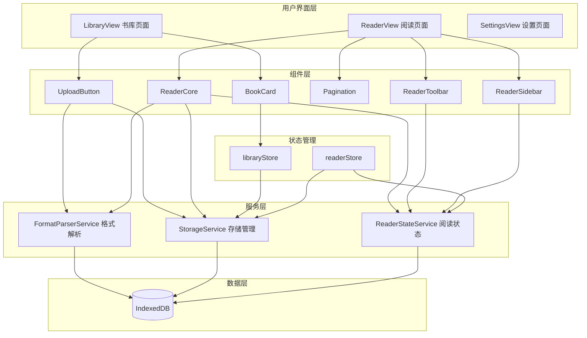
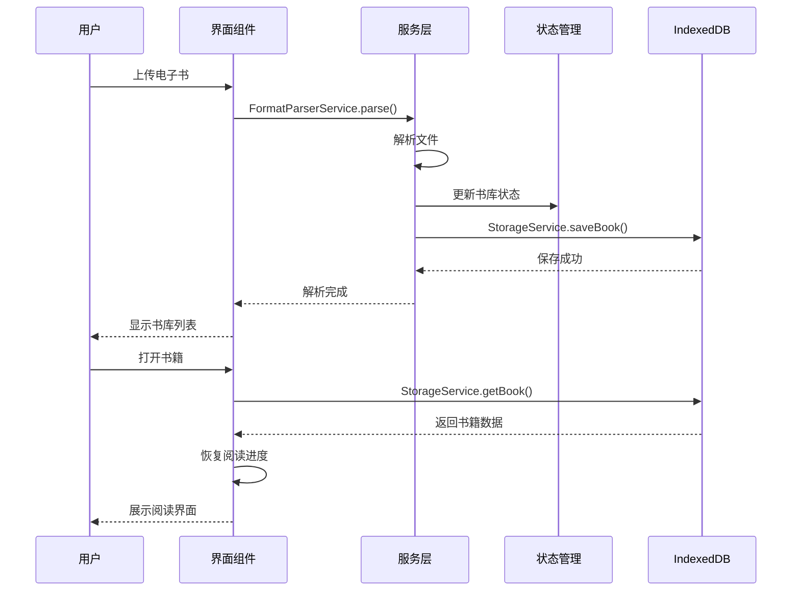

# 电子书阅读器 (QReader)

<div align="center">


一款基于 Web 的单机版电子书阅读器，支持多种格式的电子书导入、管理和阅读。


[在线预览](#在线预览) • [功能特性](#功能特性) • [技术栈](#技术栈) • [快速开始](#快速开始) • [项目结构](#项目结构) • [开发指南](#开发指南)

</div>

---

## 📖 项目简介

电子书阅读器是一款纯前端单机版阅读应用，支持 **TXT、PDF、EPUB、MOBI、DOCX、Markdown** 等多种格式的电子书。所有数据存储在浏览器 OPFS (Origin Private File System) 中，不支持 OPFS 的浏览器自动降级到 IndexedDB。无需后端服务，保护用户隐私。后续可通过 Electron 打包为桌面应用。
- 注：由于本人还在上学，平常没有太多时间，打包工作可能没有太多时间做，但是代码会持续更新，如果觉得有用，大家直接拿去用就行了。（release中已发布两个版本，欢迎🤗使用，并提出宝贵意见！）
- 部分内容由AI生成，注意甄别🤭🤭

### 核心优势

- **完全离线**: 所有数据本地存储，无需联网
- **多格式支持**: 覆盖主流电子书格式
- **功能完整**: 书签、笔记、高亮、进度管理
- **轻量快速**: 基于 Vite 构建，启动秒开
- **可扩展**: 支持后续打包为桌面应用

### 🎬 演示视频

> 视频已上传至 [GitHub Release](https://github.com/qiz7z/reader_v0/releases)，可在 Release 页面下载观看。
---

## ✨ 功能特性

### 📚 书库管理
- 上传本地电子书文件
- 以网格形式展示所有书籍
- 显示书籍封面、标题、作者、文件大小
- 支持删除书籍（级联删除书签和笔记）
- **魔法学院风格 UI**: 首页和书架页沉浸式品牌视觉体验

### 📖 阅读体验
- **多格式统一渲染**: TXT、PDF、EPUB、MOBI、DOCX、Markdown
- **滚动模式**: 滚动阅读，底部功能栏显示时间/字数/章节号
- **翻页模式**: 左右双栏翻页，键盘方向键支持，朗读时自动翻页追踪
- **全屏阅读**: 右下角浮动按钮一键切换全屏模式
- **响应式布局**: 自适应窗口大小，移动端友好

### 🔊 朗读功能
- **Edge TTS 引擎**: 桌面端默认使用 Edge TTS，集成 6 个中文神经音色（晓晓、晓依、云健、云希、云夏、云扬），Vite 启动时自动启动代理服务器
- **WebSocket 直连模式**: 浏览器端直接通过 WebSocket 连接微软 Edge TTS 服务（8 秒超时），直连失败自动回退本地代理
- **TTS 架构简化**: 移除 WebSocket 直连方案，统一走本地代理服务器，不再有 8 秒超时等待
- **滑动窗口预取**: 播放当前句时后台预取接下来 3 句，消除句子间停顿和卡顿
- **失败自动跳过**: 单句合成失败重试 1 次后自动跳到下一句，不再卡死在一句上
- **服务端重试**: Edge TTS 间歇性空音频时服务端自动重试 2 次
- **15s 超时保护**: 前后端双重超时，避免无限等待
- **移动端 SpeechSynthesis**: Android/iOS 使用浏览器内置引擎，零网络依赖
- **朗读面板 UI**: 渐变播放按钮 + 呼吸脉动动画 + 声波跳动效果
- **音色胶囊按钮**: 可视化音色选择（男蓝女粉头像 + 风格标签）
- **底部栏状态指示**: 播放时蓝色呼吸灯，暂停时橙色常亮
- **语速调节**: 0.5x ~ 1.5x 可调
- **暂停/恢复**: 支持暂停和精确恢复
- **自动跳章**: 读完一章自动跳到下一章
- **段落跳转**: 朗读时点击正文任意段落可跳转朗读位置

### ⚙️ 个性化设置
- **字体选择**: 12 种字体（默认、宋体、楷体、黑体、等宽、仿宋、魏碑、行楷、隶书、幼圆、琥珀、新宋）
- **字号调节**: 5 档字号切换
- **字重调节**: 5 档字重切换（多层阴影堆叠模拟加粗）
- **行间距**: 5 档行间距调节
- **主题切换**: 白天/夜间/护眼/羊皮卷 四种主题

### 🔖 书签管理
- 任意位置添加书签
- 书签列表快速跳转
- 书签标题自定义

### 📝 笔记标注
- 选中文本添加笔记
- 文本高亮标记（6 色可选）
- 笔记列表管理
- 点击笔记跳转原文

### 🖊️ PDF 功能
- **画笔标注**: Canvas 叠加层绘制，6 色选择 + 0.5-10mm 笔触粗细
- **荧光笔标注**: 半透明涂抹效果，4 种荧光色（黄、绿、粉、蓝）
- **线条擦除**: 鼠标划过标注线条即擦除
- **圈套擦除**: 画圈选区，射线法检测圈内标注并批量清除
- **标注数据本地持久化**: 收起工具栏后标注仍可见

### 💾 进度保存
- 自动保存阅读进度
- 下次打开自动跳转上次阅读位置
- 每本书独立进度记录
- 支持数据导出/导入（JSON 备份）

### 🖥️ 桌面应用
- **Electron 打包**: 双版本输出 — NSIS 安装版 + Portable 便携版，集成 TTS 代理
- **启动画面**: Electron 版启动时显示 QReader 品牌加载动画

---

## 🛠️ 技术栈

| 类别 | 技术 | 版本 |
|------|------|------|
| **框架** | Vue 3 (组合式 API) | 3.5.34 |
| **语言** | TypeScript | 5.x |
| **构建工具** | Vite | 8.x |
| **路由** | Vue Router | 5.x |
| **状态管理** | Pinia | 3.x |
| **UI 组件** | Element Plus | 2.14 |
| **数据存储** | OPFS (IndexedDB 降级) | 原生 API |
| **数据库** | Dexie.js (可选降级) | 4.4.2 |
| **TTS 引擎** | edge-tts-universal | 1.4 |
| **桌面应用** | Electron | 42.3 |
| **打包工具** | electron-builder | 26.8 |

### 格式解析库

| 格式 | 解析库 |
|------|--------|
| EPUB | epub.js |
| PDF | pdfjs-dist |
| DOCX | mammoth |
| Markdown | marked |
| TXT | 内置解析 |
| MOBI | 自定义解析 |

---

## 🚀 快速开始

### 环境要求

- Node.js 18+ 
- npm 9+
- 现代浏览器 (Chrome, Edge, Firefox)

### 安装依赖

```bash
cd QReader
npm install
```

### 开发模式

```bash
npm run dev
```

启动后访问：`http://localhost:5173`

### 朗读功能

朗读功能使用 Edge TTS 代理服务器（端口 3004），启动 Vite 开发服务器时会**自动启动**代理：

```bash
npm run dev
```

启动后访问：`http://localhost:5173`

代理服务器会自动检测系统代理（`127.0.0.1:7892`），无需手动配置。TTS 服务在 Electron 打包版中内置，开箱即用。

### 生产构建

```bash
npm run build
```

构建输出目录：`dist/`

### 打包桌面应用 (Electron)

```bash
npm run electron:build
```

输出：`releases/QReader-1.2.3-Setup.exe`（NSIS 安装版）和 `releases/QReader-1.2.3.exe`（便携版）

---

## 📁 项目结构

```
QReader/
├── public/                   # 静态资源
│   ├── qreader-icon-transparent.png
│   └── ...
├── src/
│   ├── components/           # 可复用组件
│   │   ├── BookGrid.vue      # 书籍网格
│   │   ├── ReaderCore.vue    # 阅读器核心
│   │   ├── ReaderSidebar.vue # 阅读侧边栏
│   │   └── UploadButton.vue  # 上传按钮
│   ├── services/             # 业务服务层
│   │   ├── parsers/          # 格式解析器
│   │   │   ├── epubParser.ts
│   │   │   ├── pdfParser.ts
│   │   │   ├── docxParser.ts
│   │   │   ├── markdownParser.ts
│   │   │   ├── txtParser.ts
│   │   │   └── mobiParser.ts
│   │   ├── StorageService.ts # 存储服务 (OPFS/IndexedDB)
│   │   └── db.ts             # 数据库实例
│   ├── stores/               # Pinia 状态管理
│   │   ├── library.ts        # 书库状态
│   │   └── reader.ts         # 阅读状态
│   ├── views/                # 页面组件
│   │   ├── LibraryView.vue   # 书库页面
│   │   ├── ReaderView.vue    # 阅读页面（含 TTS 朗读逻辑）
│   │   └── SettingsView.vue  # 设置页面
│   ├── types/                # TypeScript 类型定义
│   ├── utils/                # 工具函数
│   ├── App.vue
│   └── main.ts
├── server/
│   └── http-server.js        # TTS 代理服务器 (edge-tts-universal)
├── electron/
│   └── main.cjs              # Electron 主进程（含内嵌 TTS 服务器）
├── releases/                 # 打包产物
│   └── QReader-*.exe         # Windows 便携版
├── index.html
├── package.json
├── vite.config.ts
└── tsconfig.json
```

---

## 🏗️ 架构设计

### 系统架构图



### 数据流



---

## 📋 路由说明

| 路由 | 页面 | 说明 |
|------|------|------|
| `/` | LibraryView | 书库首页 |
| `/book/:id` | ReaderView | 阅读页面 |
| `/settings` | SettingsView | 设置页面 |

---

## 💾 数据存储

### 存储方案

**主存储**: OPFS (Origin Private File System) - 浏览器原生文件系统 API

**降级方案**: IndexedDB (Dexie.js) - 当浏览器不支持 OPFS 时自动切换

### OPFS 存储结构

```
OPFS 根目录/
├── books/              # 书籍文件
│   ├── {bookId}.json   # 书籍元数据
│   ├── {bookId}_raw    # 原始文件 (ArrayBuffer)
│   ├── {bookId}_cover  # 封面图片 (ArrayBuffer)
│   └── {bookId}_parsed.json  # 解析后的内容
├── bookmarks/          # 书签
│   └── {bookId}.json
├── notes/              # 笔记
│   └── {bookId}.json
├── progress/           # 阅读进度
│   └── {bookId}.json
├── pdf-annotations/    # PDF 标注
│   └── {bookId}.json
└── settings.json       # 全局设置
```

### IndexedDB 结构（降级时使用）

数据库名：`EbookReaderDB`

```typescript
{
  books: 'id, title, format, updatedAt',        // 书籍元数据
  parsedBooks: 'bookId',                        // 解析后的内容
  bookmarks: '++id, bookId, chapterId',         // 书签记录
  notes: '++id, bookId, chapterId',             // 笔记记录
  progress: 'bookId',                           // 阅读进度
  settings: 'key'                               // 用户设置
}
```

### 数据导出/导入

**导出**: 设置页面 → 导出数据 → 下载 JSON 备份文件

**导入**: 设置页面 → 导入数据 → 选择 JSON 文件 → 恢复数据

**备份文件格式**:
```json
{
  "version": 1,
  "exportDate": "2026-05-23T...",
  "books": { ... },
  "parsedBooks": { ... },
  "bookmarks": { ... },
  "notes": { ... },
  "progress": { ... },
  "settings": { ... },
  "pdfAnnotations": { ... }
}
```

### 数据类型

详见 [`src/types/index.ts`](src/types/index.ts)

- `ParsedBook`: 解析后的电子书结构
- `BookRecord`: 书籍元数据记录
- `BookmarkRecord`: 书签记录
- `NoteRecord`: 笔记记录
- `ProgressRecord`: 阅读进度
- `ReaderSettings`: 阅读器设置

---

## 🔌 核心 API

### FormatParserService

```typescript
// 解析电子书文件
parse(file: File): Promise<ParsedBook>
```

### StorageService

```typescript
// 保存书籍元数据
saveBook(book: BookRecord): Promise<void>

// 获取书籍列表
getBooks(): Promise<BookRecord[]>

// 删除书籍（级联删除）
deleteBook(id: string): Promise<void>

// 保存阅读进度
saveProgress(progress: ProgressRecord): Promise<void>

// 获取阅读进度
getProgress(bookId: string): Promise<ProgressRecord | null>

// 添加书签
addBookmark(bookmark: BookmarkRecord): Promise<void>

// 添加笔记
addNote(note: NoteRecord): Promise<void>
```

---

## 🧪 测试

```bash
# 类型检查
npm run typecheck

# 构建测试
npm run build
```

---

## 📦 部署

### 静态部署

生产构建后的 `dist/` 目录可部署到任意静态托管服务：

- Vercel
- Netlify
- GitHub Pages
- Cloudflare Pages

### 桌面应用 (Electron)

```bash
# 构建前端 + 打包 Electron 便携版
npm run electron:build
```

输出：`releases/QReader-1.2.3-Setup.exe`（NSIS 安装版）和 `releases/QReader-1.2.3.exe`（便携版）

Electron 版本集成了 TTS 代理服务器，朗读功能开箱即用。

---

## 🎯 开发指南

### 添加新格式支持

1. 在 `src/services/parsers/` 创建新的解析器
2. 实现 `Parser` 接口
3. 在 `FormatParserService` 中注册
4. 更新支持的格式列表

### 添加新组件

1. 在 `src/components/` 创建组件
2. 使用 TypeScript 定义 Props 类型
3. 遵循 Vue 3 组合式 API 风格
4. 导出组件并在需要的地方引入

### 状态管理规范

- 全局状态使用 Pinia Store
- 组件本地状态使用 `ref`/`reactive`
- 避免跨 Store 直接访问
- Service 层封装复杂业务逻辑

---

## 📄 文档

- [需求文档](.monkeycode/specs/ebook-reader/requirements.md) - 功能需求和验收标准
- [技术设计](.monkeycode/specs/ebook-reader/design.md) - 架构设计和技术方案
- [架构文档](.monkeycode/docs/ARCHITECTURE.md) - 系统架构详解
- [接口定义](.monkeycode/docs/INTERFACES.md) - API 和类型定义
- [开发者指南](.monkeycode/docs/DEVELOPER_GUIDE.md) - 开发环境和规范

---

## 🔧 常见问题

### Q: 数据会丢失吗？

A: 数据存储在浏览器 OPFS 中，支持原子写入，比 IndexedDB 更可靠。但清除浏览器网站数据仍会删除 OPFS 数据。建议定期使用**导出功能**备份重要书籍。

### Q: 支持多大的文件？

A: OPFS 通常支持 2GB+ 存储空间，理论上可支持 50-100MB 的单个文件，受浏览器配额限制。

### Q: 可以在手机上使用吗？

A: 可以，应用采用响应式设计，支持移动设备浏览器。但 OPFS 在部分移动浏览器可能不支持，此时会自动降级到 IndexedDB。

### Q: 如何备份数据？

A: 设置页面 → 点击"导出数据"按钮 → 下载 JSON 备份文件。恢复时点击"导入数据"选择备份文件即可。

### Q: 我的浏览器支持 OPFS 吗？

A: OPFS 支持 Chrome 102+、Edge 102+、Firefox 111+、Safari 17.4+。可以在设置页面查看当前使用的存储方式。不支持 OPFS 时会自动降级到 IndexedDB。

### Q: 朗读功能如何使用？

A: 朗读功能使用 Edge TTS 引擎，打开任意书籍后点击底部控制栏的朗读按钮即可。Vite 启动时会自动运行 TTS 代理服务器（端口 3004），无需手动启动。Electron 打包版内置 TTS 服务，开箱即用。

### Q: 朗读支持哪些浏览器？

A: 所有现代浏览器均支持（Chrome、Edge、Firefox、Safari）。TTS 通过本地代理服务器（`localhost:3004`）调用 Edge TTS 语音，Firefox 下也能正常工作。

### Q: Electron 打包后朗读功能正常吗？

A: 正常。Electron 版本在主进程中集成了 TTS 代理服务器，无需额外配置。

---

## 📝 更新日志

> 以下是本项目自 2026-05-13 创建以来的全部变更记录，按功能类别组织。
>
> 完整 Git 历史：[GitHub Commits](https://github.com/qiz7z/reader_v0/commits)

### ✨ 朗读 (TTS)

#### 新增功能
- **TTS 纯代理方案**: 移除 WebSocket 直连（Firefox 下不可用），统一走本地代理服务器，不再有 8 秒超时等待
- **TTS 代理自动启动**: Vite 启动时自动运行代理服务器（`server/http-server.js`），无需手动执行 `npm run server`
- **滑动窗口预取**: 预取从 1 句改为 3 句（Map 缓存 + pendingSet 防重复），消除朗读卡顿
- **失败自动跳过**: 每句重试 1 次后跳到下一句，不再原地卡死
- **前端 15s 超时**: fetch 独立超时控制，替代后端 15s 干等
- **朗读面板 UI 升级**: 渐变播放按钮 + 呼吸脉动 + 声波柱动画 + 状态药丸
- **音色胶囊按钮**: 下拉框改为 2 列胶囊按钮网格（男蓝女粉头像 + 风格标签）
- **底部栏状态指示**: 播放时蓝色呼吸灯 + 暂停图标，暂停时橙色常亮
- **服务端重试**: Edge TTS 间歇性空音频时自动重试 2 次
- **Edge TTS 朗读**: 集成 6 个 Edge 中文神经音色（晓晓、晓依、云健、云希、云夏、云扬）
- **Edge TTS 代理服务器**: 通过 Node.js 代理（端口 3004）实现 TTS 服务，支持 `npm run server` 启动
- **朗读自动滚动**: 朗读时自动追踪并滚动到当前句子位置
- **朗读高亮增强**: 当前朗读句子高亮样式增加圆角和阴影效果，支持主题适配
- **朗读自动跳章**: 朗读到章节末尾时自动跳到下一章继续
- **朗读错误 Toast**: 用户可见的错误提示（代理不可用、合成失败等）
- **单句预取**: 播放当前句时后台预取下一句，消除句子间停顿
- **暂停/恢复**: 保存播放位置，恢复时精确到秒

#### 问题修复
- **TTS 幽灵链**: 修复 `stopReadAloud()` 后旧异步链仍在运行导致段落乱跳的问题（引入 `ttsGeneration` 计数器）
- **段落跳转幽灵链**: 修复 `onParagraphClick` 跳转时未递增 `ttsGeneration`，导致旧预取和重试 setTimeout 仍执行
- **SpeechSynthesis 重试计数**: 修复移动端 `handleSpeechError` 使用全局 `retryCount` 导致跨句累加、提前停止朗读的问题，改为 per-index `retryMap`
- **定时器泄漏**: 修复 `tryNextChapter` 的 setTimeout 和 `ttsToastTimer` 未在组件卸载时清理
- **代理不可用提示**: 启动朗读时检测代理状态，不可用时弹 toast 提醒
- **重复跳章**: 修复 `tryNextChapter()` 缺少防重入保护导致连跳两章的问题
- **暂停失效**: 修复 `toggleReadAloud` 逻辑缺陷和 `speechSynthesis.pause()` 不可靠的问题
- **音色切换乱跳**: 修复 `startReadAloud()` 内部 `loadAllVoices()` 覆盖用户选择的问题
- **语音合成超时**: 代理服务器增加请求超时保护，避免无限等待

### 🎨 UI / 主题

#### 新增功能
- **魔法学院 UI 设计**: 首页和书架页全新魔法学院风格，品牌文字艺术效果增强
- **QReader 品牌重塑**: 首页 Logo 与品牌名横向布局，移除白色背景，使用蓝色图标
- **PDF 全屏阅读**: 支持 PDF 全屏模式，右下角浮动按钮一键切换
- **阅读信息栏**: 左下角浮动显示实时时间和阅读字数统计（已读/总字数）
- **书架阅读时长**: 书架页显示总阅读时长统计
- **右侧面板 UI 重新设计**: 5 个功能按钮（朗读、书架、设置、标注、书签）全面升级
- **毛玻璃拟态效果**: 右侧面板采用 `backdrop-filter: blur(16px)` 半透明磨砂玻璃效果
- **Lucide SVG 图标**: 所有功能按钮替换为矢量 SVG 图标
- **卡片式设置分组**: 设置面板采用卡片式分组布局

#### 优化改进
- **主题色统一**: 主色调切换为 Tailwind Blue (`#3b82f6`)
- **字体粗细默认调整**: 第 3 档（font-weight 600），阅读体验更舒适
- **字体粗细渲染优化**: 改用 `-webkit-text-stroke`，消除 text-shadow 重影
- **界面动画升级**: 底部栏和信息栏使用 spring 缓动曲线滑入滑出动画
- **底部栏毛玻璃效果**: `backdrop-filter: blur(28px)` 毛玻璃 + 饱和度增强
- **底部信息栏联动**: 点击中间隐藏 UI 时信息栏同步隐藏
- **翻页按钮可视化**: 翻页箭头始终半透明可见，hover 放大 + 毛玻璃背景
- **底部控制栏**: 透明背景、章节号恢复、主题适配
- **翻章按钮立体效果**: 渐变背景 + 底部阴影 + 按压反馈
- **按钮悬停动效**: 上浮 + 阴影 + 缩放反馈，cubic-bezier 缓动函数
- **面板过渡动画**: 右侧面板展开/收起使用 0.3s cubic-bezier 过渡
- **主题按钮统一**: 高度统一为 36px，圆角统一为 8px
- **字体统一**: 底部页码和章节码数字统一为 Georgia/Times New Roman 衬线字体
- **信息栏布局优化**: 整合时间/字数/页码/章节进度，全屏时自动隐藏
- **字重 5 档**: 多层阴影堆叠模拟加粗，Windows 微软雅黑优化
- **工具栏尺寸缩小**: 按钮、图标、颜色圆点等尺寸统一缩小

#### 问题修复
- **主题切换修复**: 修复 CSS 重复块导致的主题切换问题
- **全屏按钮隐藏**: 修复黑夜模式下全屏按钮与背景融合不可见问题
- **缩放控件样式**: 羊皮卷模式下固定白色背景，移除黄色方框和分隔线
- **PDF 缩放滑块**: 修复 WebKit/Firefox 样式覆盖
- **编译错误**: 修复多余 div 闭合标签
- **章节跳转修复**: 修复底部功能栏章节指示器点击无法输入数字跳转的问题
- **Favicon 更新**: 更换为无白边的透明图标

### 📖 阅读模式

#### 新增功能
- **翻页模式**: TXT/EPUB/MD 等非 PDF 格式的翻页阅读模式，左右双栏 CSS Grid 布局
- **键盘快捷键**: 支持左右方向键 (ArrowLeft/ArrowRight) 翻页（朗读播放时自动禁用，避免冲突）
- **章节导航**: 翻页按钮支持跨章节翻页（章首翻到上一章末页，章尾翻到下一章首页）
- **章节跳转简化**: 移除右下角重复的上一章/下一章按钮，统一在底部功能栏操作
- **翻页模式 TTS 自动翻页**: 朗读推进时自动翻到包含当前句子的页（sentenceToPage 映射）
- **翻页模式保留位置**: 滚动模式切到翻页模式时，自动定位到当前朗读句所在页

#### 优化改进
- **翻页竞态修复**: 跨章翻页改用 `recalcVersion` 守卫 + `nextTick`，替代 `setTimeout`，消除页码错乱
- **分页测量优化**: 改用 `.page-col-left` 真实列宽测量，与渲染一致
- **recalcPages 容错**: viewport 未挂载时带重试上限（最多 5 次），防止无限递归栈溢出
- **高亮卡顿修复**: 使用 `nextTick()` 延迟重排，减少主线程阻塞
- **超大段落优化**: `splitOversized` 函数支持 HTML 标签，高亮标记不会在分页时丢失
- **划线笔记修复**: 翻页模式下划线笔记功能正常，保存后立即重绘高亮
- **翻页按钮交互**: 两侧翻页按钮默认隐藏，鼠标进入页面区域同时显现
- **侧边栏主题适配**: 左侧折叠目录栏 hover 时背景色随主题变化
- **目录默认收起**: 目录面板初始状态改为收起
- **章节指示器**: 统一 ref 引用，修复点击跳转问题

#### 移除功能
- 移除翻页模式相关代码和 CSS（v0.6.0）
- 重新实现翻页阅读模式（v0.7.0）
- 移除行间距右侧文字标签（"超宽"/"标准"等）

### 📝 标注功能

#### 新增功能
- **PDF 画笔标注**: Canvas 叠加层绘制，6 色选择 + 0.5-10mm 笔触粗细
- **荧光笔标注**: 半透明涂抹效果，4 种荧光色（黄、绿、粉、蓝）
- **线条擦除**: 鼠标划过标注线条即擦除（点到线段距离检测）
- **圈套擦除**: 画圈选区，射线法检测圈内标注并批量清除
- **标注常驻显示**: 收起标注工具栏后标注内容仍可见
- **标注撤销功能**: 支持撤销上一笔标注和清除全部标注
- **画笔粗细调节**: 标注工具支持 5 档画笔粗细选择 (1/2/3/4/6px)
- **PDF 缩放重构**: 移除 CSS `zoom`，改用 `BASE_RENDER_SCALE=2.0` 高清渲染 + `transform: scale()` GPU 合成缩放，滑块 rAF 直接操作 DOM，拖拽实时响应无卡顿

#### 优化改进
- **标注存储重构**: 切换至 LocalStorage，按文件 hash 隔离标注数据
- **擦除精度优化**: 点到线段距离替代点到点距离，线段间穿越也能命中
- **坐标映射修复**: 用 `screenX * canvas.width / rect.width` 消除 CSS zoom 偏差
- **鼠标事件分离**: lasso 模式下 mouseleave 只清理状态不触发检测
- **工具栏图标优化**: 重新设计线条擦除、圈套擦除、清除全部图标
- **标注工具栏合并**: 将标注工具与缩放控件合并为同一浮动栏
- **清除按钮危险色**: 清除全部按钮 hover 时变红色，警示性更强
- **荧光笔独立线宽**: 像素级宽度（10-40px），与画笔毫米级宽度分离

#### 问题修复
- 修复 mouseleave 触发 lasso 误擦除圈外标注
- 修复收起工具栏后标注消失
- 修复 `setTransform` 参数错误
- 修复 PDF 缩放后标注坐标计算错误
- 修复标注保存后刷新丢失的问题
- 修复擦除模式坐标系统一问题
- 修复划线笔记颜色总是重置为黄色的问题

#### 移除功能
- 移除 PDF 文本高亮功能（textLayer 实现存在兼容性问题）

### 💾 存储 / 数据

#### 新增功能
- **OPFS 存储**: 使用 Origin Private File System 作为主存储，更可靠、更安全
- **数据导出/导入**: 支持 JSON 备份和恢复
- **存储降级**: 不支持 OPFS 的浏览器自动降级到 IndexedDB
- **数据迁移**: 首次使用时自动从 IndexedDB 迁移数据到 OPFS
- **存储状态显示**: 设置页面显示当前使用的存储方式

### 🖥️ Electron / 桌面应用

#### 优化改进
- **桌面图标**: Electron 打包后 Windows 显示标准 ICO 图标（16/32/48/256）
- **TTS 集成**: Electron 版本集成 TTS 代理服务器，朗读功能开箱即用
- **启动画面**: 显示 QReader 品牌加载动画

#### 问题修复
- 修复 Electron 打包后图标显示默认图标的问题

### 🔧 构建 / 配置

#### 优化改进
- **TTS 代理自动启动**: vite.config.ts 新增 Vite 插件，开发服务器启动时自动运行 TTS 代理，无需手动启动
- **PDF.js Worker**: 离线版本本地化，不依赖 CDN
- **构建配置**: 优化 Vite 配置，添加 AllowedHosts 支持远程预览
- **base 路径修复**: 修复 `base: './'` 导致构建产物资源引用错误的问题
- **代码清理**: 移除临时服务器文件，仅保留 http-server.js

#### 问题修复
- 修复 TypeScript 类型定义错误
- 修复阅读时长保存覆盖阅读位置（`saveReadingTime` 将 `position` 设为 0 导致跳转位置丢失）

### 📄 早期版本（v0.1.0）

- PDF 章节导航、页码指示器、基础画笔标注、标注擦除功能
- 基础架构搭建、类型定义、数据库设计
- 修复 PDF 缩放坐标、标注刷新丢失等初始问题

---

---

## 🤝 贡献

欢迎提交 Issue 和 Pull Request！

---

## 📄 许可证

MIT License

---

## 📮 联系方式

- 项目仓库：[GitHub](https://github.com/qiz7z/reader_v0)
- 问题反馈：[Issues](https://github.com/qiz7z/reader_v0/issues)

---

<div align="center">

**感谢使用！** 📚

如果这个项目对你有帮助，欢迎给一个 ⭐ Star

</div>
