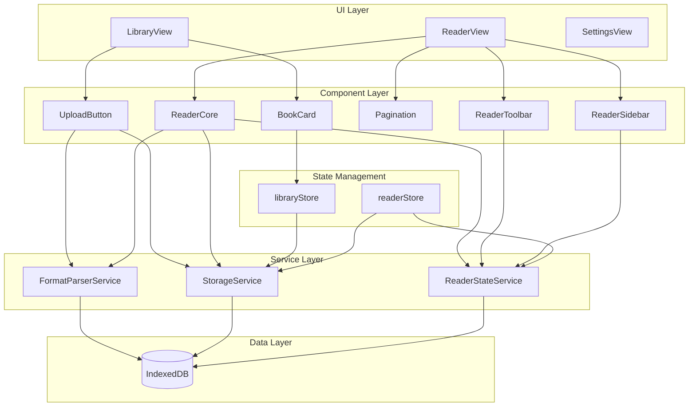
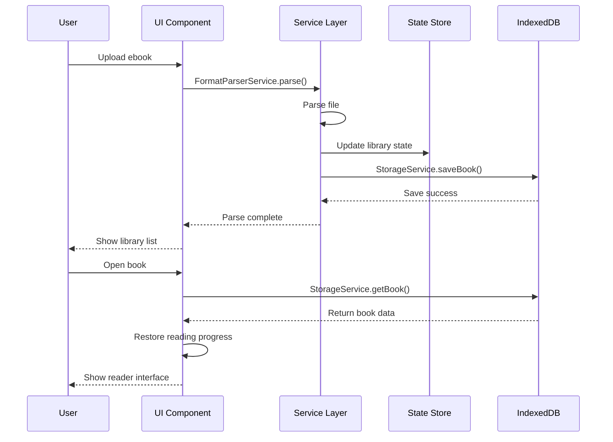

<div align="center">
  
</div>

<div align="center">

A web-based single-page ebook reader supporting multiple formats including TXT, PDF, EPUB, MOBI, DOCX, and Markdown.


[Online Demo](#online-demo) • [Features](#features) • [Tech Stack](#tech-stack) • [Quick Start](#quick-start) • [Project Structure](#project-structure) • [Developer Guide](#developer-guide)

</div>

---

## 📖 Introduction

Ebook Reader is a pure frontend single-page application that supports multiple ebook formats. All data is stored locally in browser OPFS (Origin Private File System), with automatic fallback to IndexedDB for unsupported browsers. No backend required, ensuring privacy. Can be packaged as a desktop app via Electron.
- Note: Since I am still pursuing a master's degree, I don't have much time, so there may not be much time to package the work, but the code will continue to be updated. If you find it useful, you can just use it directly. (Two versions have been released in the release section, welcome 🤗 to use and provide valuable feedback!)
- Some content is AI-generated, please verify carefully 🤭🤭

### Core Advantages

- **Fully Offline**: All data stored locally, no internet required
- **Multi-Format Support**: Covers mainstream ebook formats
- **Complete Features**: Bookmarks, notes, highlights, progress tracking
- **Lightweight & Fast**: Vite-powered, instant startup
- **Extensible**: Supports future desktop app packaging

### 🎬 Demo Video

> The demo video is available on [GitHub Release](https://github.com/qiz7z/reader_v0/releases) for download.

---

## ✨ Features

### 📚 Library Management
- Upload local ebook files
- Grid/list view of all books
- Display cover, title, author, file size, reading time
- Delete books (cascade delete bookmarks and notes)
- **Magic Academy UI**: Immersive brand visuals on Home and Library pages

### 📖 Reading Experience
- Unified rendering for multiple formats
- Page navigation (prev/next)
- Reading progress display (percentage/page number)
- **TXT Live Info Bar**: Real-time clock and word count (read/total) at bottom-left, visible in both fullscreen and normal modes
- **Page Flip Mode**: Left-right dual-column layout with auto page turn during read aloud
- Responsive layout, adaptive to window size

### ⚙️ Personalized Settings
- **Font Size**: 5-level font size adjustment
- **Font Weight**: 5-level font weight (multi-layer shadow stacking, Windows optimized)
- **Theme Switch**: Light/Dark/Green mode
- **Reading Settings**: Line spacing, margins, font family

### 🔖 Bookmark Management
- Add bookmarks at any position
- Quick jump from bookmark list
- Customizable bookmark titles

### 🔊 Read Aloud
- **Edge TTS Engine**: Desktop defaults to Edge TTS with 6 Chinese neural voices (Xiaoxiao, Xiaoyi, Yunjian, Yunxi, Yunxia, Yunyang)
- **Sliding Window Prefetch**: Prefetches next 3 sentences while current one plays, eliminating gaps and stuttering
- **Skip on Fail**: Retries once per sentence then auto-skips, never gets stuck on one sentence
- **Server-Side Retry**: Auto-retries up to 2 times when Edge TTS returns empty audio
- **15s Timeout Protection**: Dual timeout on frontend and backend, no infinite waiting
- **Mobile SpeechSynthesis**: Android/iOS uses browser built-in engine, zero network dependency
- **Read Aloud Panel UI**: Gradient play button + breathing pulse animation + wave bars
- **Voice Chip Grid**: Visual voice selection (male blue / female pink avatars + style tags)
- **Bottom Bar Status Indicator**: Blue breathing dot when playing, orange solid when paused
- **Speed Control**: 0.5x ~ 1.5x adjustable
- **Pause/Resume**: Precise position save and restore
- **Auto Chapter Advance**: Automatically continues to next chapter
- **Paragraph Jump**: Click any paragraph during read aloud to jump to that position

### 🖥️ Desktop App
- **Electron Packaging**: Dual output — NSIS installer + Portable EXE, with built-in TTS proxy
- **Splash Screen**: Branded QReader loading animation on startup

### 📝 Notes & Highlights
- Select text to add notes
- Text highlighting
- Notes list management
- Click note to jump to original text

### 🖊️ PDF Features
- **Pen Annotation**: Canvas overlay with 6 colors, 0.5-10mm stroke width
- **Highlighter Annotation**: Semi-transparent painting effect, 4 fluorescent colors (yellow, green, pink, blue), 10-40px stroke width
- **Line Erase**: Swipe across annotation strokes to erase (segment distance detection)
- **Lasso Erase**: Draw a loop, ray-casting detection to batch erase annotations inside
- **Fullscreen**: Bottom-right floating button for one-click fullscreen toggle
- **Persistent Annotations**: Annotations visible even when toolbar is collapsed

### 💾 Progress Saving
- Auto-save reading progress
- Auto-jump to last position on reopen
- Independent progress per book


## 🛠️ Tech Stack

| Category | Technology | Version |
|----------|------------|---------|
| **Framework** | Vue 3 (Composition API) | 3.5.34 |
| **Language** | TypeScript | 5.x |
| **Build Tool** | Vite | 8.x |
| **Router** | Vue Router | 5.x |
| **State Management** | Pinia | 3.x |
| **UI Components** | Element Plus | 2.14 |
| **Data Storage** | OPFS (IndexedDB Fallback) | Native API |
| **Database Library** | Dexie.js (Fallback) | 4.4.2 |
| **TTS Engine** | SpeechSynthesis + edge-tts-universal | Native + 1.4 |
| **Desktop App** | Electron + electron-builder | 42.3 + 26.8 |

### Format Parsing Libraries

| Format | Library |
|--------|---------|
| EPUB | epub.js |
| PDF | pdfjs-dist |
| DOCX | mammoth |
| Markdown | marked |
| TXT | Built-in parser |
| MOBI | Custom parser |

---

## 🚀 Quick Start

### Requirements

- Node.js 18+ 
- npm 9+
- Modern browser (Chrome, Edge, Firefox)

### Install Dependencies

```bash
cd workspace
npm install
```

### Development Mode

```bash
npm run dev
```

Open `http://localhost:5173` after startup.

### Production Build

```bash
npm run build
```

Build output directory: `dist/`

### Read Aloud (Optional Enhancement)

Read Aloud defaults to the browser's built-in SpeechSynthesis engine — no configuration needed. For higher-quality Edge TTS voices, optionally start the proxy server:

```bash
npm run server
```

The proxy runs at `http://localhost:3004` and the frontend will auto-detect and switch.

---

## 📁 Project Structure

```
ebook-reader/
├── .monkeycode/              # Project specs and docs
│   ├── docs/                 # Documentation
│   │   ├── ARCHITECTURE.md   # Architecture design
│   │   ├── INTERFACES.md     # Interface definitions
│   │   └── DEVELOPER_GUIDE.md # Developer guide
│   └── specs/                # Feature specs
│       └── ebook-reader/
│           ├── requirements.md # Requirements
│           ├── design.md     # Technical design
│           └── tasklist.md   # Task list
├── public/                   # Static assets
│   ├── favicon.svg
│   └── icons.svg
├── src/
│   ├── assets/               # Assets (images, styles)
│   ├── components/           # Reusable components
│   │   ├── AppLayout.vue     # App layout
│   │   ├── BookGrid.vue      # Book grid
│   │   ├── Pagination.vue    # Pagination
│   │   ├── ReaderCore.vue    # Reader core
│   │   ├── ReaderSidebar.vue # Reader sidebar
│   │   ├── ReaderToolbar.vue # Reader toolbar
│   │   ├── SearchBar.vue     # Search bar
│   │   ├── Toast.vue         # Toast
│   │   └── UploadButton.vue  # Upload button
│   ├── router/               # Router config
│   │   └── index.ts
│   ├── services/             # Business logic layer
│   │   ├── parsers/          # Format parsers
│   │   │   ├── epubParser.ts
│   │   │   ├── pdfParser.ts
│   │   │   ├── docxParser.ts
│   │   │   ├── markdownParser.ts
│   │   │   ├── txtParser.ts
│   │   │   └── mobiParser.ts
│   │   ├── db.ts             # Database instance
│   │   ├── FormatParserService.ts # Parser service
│   │   └── StorageService.ts # Storage service
│   ├── stores/               # State management
│   │   ├── library.ts        # Library state
│   │   └── reader.ts         # Reader state
│   ├── types/                # TypeScript type definitions
│   │   └── index.ts
│   ├── utils/                # Utility functions
│   │   └── settings.ts
│   ├── views/                # Page components
│   │   ├── LibraryView.vue   # Library page
│   │   ├── ReaderView.vue    # Reader page
│   │   └── SettingsView.vue  # Settings page
│   ├── App.vue               # Root component
│   ├── main.ts               # Entry point
│   └── style.css             # Global styles
├── index.html                # HTML entry
├── package.json              # Dependencies
├── tsconfig.json             # TypeScript config
└── vite.config.ts            # Vite config
```

---

## 🏗️ Architecture

### System Architecture



### Data Flow



---

## 📋 Routes

| Route | Page | Description |
|-------|------|-------------|
| `/` | LibraryView | Library home |
| `/book/:id` | ReaderView | Reader page |
| `/settings` | SettingsView | Settings page |

---

## 💾 Data Storage

### Storage Solution

**Primary**: OPFS (Origin Private File System) - Browser native File System API

**Fallback**: IndexedDB (Dexie.js) - Automatic fallback when OPFS is unsupported

### OPFS Storage Structure

```
OPFS Root/
├── books/              # Book files
│   ├── {bookId}.json   # Book metadata
│   ├── {bookId}_raw    # Raw file (ArrayBuffer)
│   ├── {bookId}_cover  # Cover image (ArrayBuffer)
│   └── {bookId}_parsed.json  # Parsed content
├── bookmarks/          # Bookmarks
│   └── {bookId}.json
├── notes/              # Notes
│   └── {bookId}.json
├── progress/           # Reading progress
│   └── {bookId}.json
├── pdf-annotations/    # PDF annotations
│   └── {bookId}.json
└── settings.json       # Global settings
```

### IndexedDB Schema (Fallback)

Database name: `EbookReaderDB`

```typescript
{
  books: 'id, title, format, updatedAt',        // Book metadata
  parsedBooks: 'bookId',                        // Parsed content
  bookmarks: '++id, bookId, chapterId',         // Bookmarks
  notes: '++id, bookId, chapterId',             // Notes
  progress: 'bookId',                           // Reading progress
  settings: 'key'                               // User settings
}
```

### Data Export/Import

**Export**: Settings page → Export Data → Download JSON backup

**Import**: Settings page → Import Data → Select JSON file → Restore

**Backup File Format**:
```json
{
  "version": 1,
  "exportDate": "2026-05-23T...",
  "books": { ... },
  "parsedBooks": { ... },
  "bookmarks": { ... },
  "notes": { ... },
  "progress": { ... },
  "settings": { ... },
  "pdfAnnotations": { ... }
}
```

### Type Definitions

See [`src/types/index.ts`](src/types/index.ts)

- `ParsedBook`: Parsed ebook structure
- `BookRecord`: Book metadata record
- `BookmarkRecord`: Bookmark record
- `NoteRecord`: Note record
- `ProgressRecord`: Reading progress
- `ReaderSettings`: Reader settings

---

## 🔌 Core API

### FormatParserService

```typescript
// Parse ebook file
parse(file: File): Promise<ParsedBook>
```

### StorageService

```typescript
// Save book metadata
saveBook(book: BookRecord): Promise<void>

// Get book list
getBooks(): Promise<BookRecord[]>

// Delete book (cascade delete)
deleteBook(id: string): Promise<void>

// Save reading progress
saveProgress(progress: ProgressRecord): Promise<void>

// Get reading progress
getProgress(bookId: string): Promise<ProgressRecord | null>

// Add bookmark
addBookmark(bookmark: BookmarkRecord): Promise<void>

// Add note
addNote(note: NoteRecord): Promise<void>
```

---

## 🧪 Testing

```bash
# Type checking
npm run typecheck

# Build test
npm run build
```

---

## 📦 Deployment

### Static Deployment

Build output `dist/` can be deployed to any static hosting:

- Vercel
- Netlify
- GitHub Pages
- Cloudflare Pages

### Desktop App (Electron)

```bash
# Build NSIS installer + Portable EXE
npm run electron:build

# Or build separately
npm run electron:build:nsis       # Installer only
npm run electron:build:portable   # Portable only
```

Output: `releases/QReader-1.2.2-Setup.exe` (NSIS installer) and `releases/QReader-1.2.2.exe` (Portable)

The Electron version has built-in TTS proxy, plus falls back to system voice.

---

## 🎯 Developer Guide

### Add New Format Support

1. Create new parser in `src/services/parsers/`
2. Implement `Parser` interface
3. Register in `FormatParserService`
4. Update supported formats list

### Add New Component

1. Create component in `src/components/`
2. Define Props types with TypeScript
3. Follow Vue 3 Composition API style
4. Export and import where needed

### State Management Guidelines

- Use Pinia Store for global state
- Use `ref`/`reactive` for local component state
- Avoid direct cross-Store access
- Service layer encapsulates complex business logic

---

## 📄 Documentation

- [Requirements](.monkeycode/specs/ebook-reader/requirements.md) - Functional requirements and acceptance criteria
- [Technical Design](.monkeycode/specs/ebook-reader/design.md) - Architecture and technical specs
- [Architecture](.monkeycode/docs/ARCHITECTURE.md) - System architecture details
- [Interfaces](.monkeycode/docs/INTERFACES.md) - API and type definitions
- [Developer Guide](.monkeycode/docs/DEVELOPER_GUIDE.md) - Development environment and standards

---

## 🔧 FAQ

### Q: Will my data be lost?

A: Data is stored in browser OPFS, which supports atomic writes and is more reliable than IndexedDB. However, clearing browser site data will still delete OPFS data. Consider using the **Export** feature to backup important books regularly.

### Q: What's the max file size supported?

A: OPFS typically supports 2GB+ storage space. Theoretically supports 50-100MB single files, subject to browser quota.

### Q: Can I use it on mobile?

A: Yes, the app uses responsive design and supports mobile browsers. Note that OPFS may not be supported in some mobile browsers and will automatically fallback to IndexedDB.

### Q: How to backup data?

A: Settings page → Click "Export Data" button → Download JSON backup file. To restore, click "Import Data" and select the backup file.

### Q: Does my browser support OPFS?

A: OPFS supports Chrome 102+, Edge 102+, Firefox 111+, Safari 17.4+. You can check the current storage method in the Settings page. Falls back to IndexedDB automatically if OPFS is unsupported.

### Q: How does Read Aloud work?

A: Read Aloud uses the browser's built-in SpeechSynthesis engine by default — just open the Read Aloud panel in any book. No server setup required. For higher-quality Edge TTS voices (Xiaoxiao, Yunxi, etc.), optionally start the proxy server (`npm run server`) and the app will auto-detect and switch.

### Q: Which browsers support Read Aloud?

A: SpeechSynthesis is supported in all major browsers (Chrome, Edge, Firefox, Safari). Edge TTS enhanced voices require the proxy server and work across all modern browsers.

### Q: Does Read Aloud work in the Electron version?

A: Yes. The Electron version has built-in TTS proxy, plus falls back to system voice.

---

## 📝 Changelog

> Below is the complete changelog since the project's creation on 2026-05-13, organized by feature category.
>
> Full Git history: [GitHub Commits](https://github.com/qiz7z/reader_v0/commits)

### ✨ Read Aloud (TTS)

#### New Features
- **Sliding Window Prefetch**: Prefetch expanded from 1 to 3 sentences (Map cache + pendingSet dedup), eliminating read aloud stuttering
- **Skip on Fail**: Retries once per sentence then auto-skips to next, never stuck on one sentence
- **Frontend 15s Timeout**: Independent fetch timeout, replacing backend 15s idle wait
- **Read Aloud Panel Redesign**: Gradient play button + breathing pulse + wave bar animation + status pill
- **Voice Chip Grid**: Dropdown replaced with 2-column chip grid (male blue / female pink avatars + style tags)
- **Bottom Bar Status Indicator**: Blue breathing dot + pause icon when playing, orange solid when paused
- **Server-Side Retry**: Auto-retries up to 2 times when Edge TTS returns empty audio
- **Edge TTS Support**: 6 Edge Chinese neural voices (Xiaoxiao, Xiaoyi, Yunjian, Yunxi, Yunxia, Yunyang)
- **TTS Proxy Server**: Node.js proxy on port 3004, start with `npm run server`
- **Auto-scroll During Read Aloud**: Automatically tracks and scrolls to the current sentence position
- **Enhanced Read Aloud Highlighting**: Current sentence highlight with rounded corners and shadow effects, theme-adaptive
- **Auto Chapter Advance**: Automatically continues to next chapter when reaching chapter end
- **TTS Error Toasts**: User-visible notifications (proxy unavailable, synthesis failed, etc.)
- **Sentence Prefetching**: Background prefetch of next sentence while current one plays, eliminating gaps
- **Pause/Resume**: Saves playback position, resumes from exact second

#### Bug Fixes
- **TTS Ghost Chain**: Fixed ghost async chain running after `stopReadAloud()` causing sentence jumping (`ttsGeneration` counter)
- **Paragraph Jump Ghost Chain**: Fixed `onParagraphClick` not incrementing `ttsGeneration`, allowing stale prefetch and retry setTimeout to execute
- **SpeechSynthesis Retry Counter**: Fixed mobile `handleSpeechError` using global `retryCount` causing cross-sentence accumulation and premature session stop, changed to per-index `retryMap`
- **Timer Leak**: Fixed `tryNextChapter` setTimeout and `ttsToastTimer` not cleaned up on component unmount
- **Proxy Unavailable Hint**: Shows toast reminder when starting read aloud with proxy down
- **Double Chapter Jump**: Fixed `tryNextChapter()` missing re-entry guard causing chapters to be skipped
- **Pause Failure**: Fixed `toggleReadAloud` logic flaw and unreliable `speechSynthesis.pause()`
- **Voice Switch Jumping**: Fixed `loadAllVoices()` overwriting user's voice selection mid-playback
- **Audio Timeout**: Proxy server added request timeout protection to prevent infinite waiting

### 🎨 UI / Theme

#### New Features
- **Magic Academy UI**: Redesigned Home and Library pages with magic academy theme
- **QReader Rebrand**: Horizontal logo + brand name layout, transparent background, blue icon
- **PDF Fullscreen**: Fullscreen reading mode with bottom-right floating toggle button
- **Reading Info Bar**: Floating bottom-left info bar with real-time clock and word count
- **Library Reading Time Stats**: Total reading time displayed on Library page
- **Right Panel Redesign**: 5 functional buttons (Read Aloud, Library, Settings, Annotations, Bookmarks) fully redesigned
- **Glassmorphism Effect**: Right panel with `backdrop-filter: blur(16px)` frosted glass effect
- **Lucide SVG Icons**: All functional buttons replaced with vector SVG icons
- **Card-style Settings**: Settings panel organized into card groups

#### Improvements
- **Unified Color Scheme**: Primary color changed to Tailwind Blue (`#3b82f6`)
- **Font Weight Default**: Adjusted to level 3 (font-weight 600) for better reading comfort
- **Font Weight Rendering**: Switched to `-webkit-text-stroke`, eliminating text-shadow artifacts
- **Bottom Bar**: Transparent background, chapter indicator restored, theme-adaptive
- **Chapter-End Buttons**: 3D effect with gradient background + bottom shadow + press feedback
- **Button Hover Effects**: Float + shadow + scale feedback with cubic-bezier easing
- **Panel Transition**: Right panel expand/collapse uses 0.3s cubic-bezier transition
- **Theme Button Consistency**: Unified height (36px) and border-radius (8px)
- **Font Consistency**: Bottom page/chapter numbers unified to Georgia/Times New Roman serif
- **Info Bar Integration**: Combines time/word count/page/chapter progress, auto-hides in fullscreen
- **Font Weight 5-Level**: Multi-layer shadow stacking, Windows Microsoft YaHei optimized
- **Toolbar Compact Size**: Buttons, icons, color dots unified to smaller sizes
- **Default Font**: KaiTi (楷体) as default on first open
- **Favicon Update**: Replaced with transparent icon (no white border)

#### Bug Fixes
- **Theme Switch Fix**: Fixed CSS duplicate blocks causing theme switching issues
- **Fullscreen Button Visibility**: Fixed fullscreen button blending into background in dark mode
- **Zoom Control Styles**: Fixed parchment mode white background, removed yellow box and divider
- **PDF Range Slider**: Fixed WebKit/Firefox style override
- **Compilation Error**: Fixed extra div closing tag
- **Chapter Indicator**: Fixed click-to-input jumping issue, unified ref references

### 📖 Reading Mode

#### New Features
- **Page Flip Mode**: Page-flip reading for TXT/EPUB/MD with left-right dual-column CSS Grid layout
- **Keyboard Shortcuts**: ArrowLeft/ArrowRight for page navigation (auto-disabled during read aloud to prevent conflicts)
- **Cross-Chapter Navigation**: Page flip buttons support chapter transitions
- **Page Mode TTS Auto Page Turn**: Automatically flips to the page containing the current sentence during read aloud (sentenceToPage mapping)
- **Page Mode Position Preservation**: Switching from scroll to page mode auto-positions to the current read aloud sentence's page

#### Improvements
- **Page Turn Race Fix**: Cross-chapter page turns now use `recalcVersion` guard + `nextTick` instead of `setTimeout`, eliminating page number desync
- **Pagination Measurement**: Uses actual `.page-col-left` clientWidth for measurement, consistent with rendering
- **recalcPages Fault Tolerance**: Retries up to 5 times when viewport not mounted, preventing infinite recursion stack overflow
- **Highlight Performance**: `nextTick()` delay reduces main thread blocking
- **Oversized Paragraphs**: `splitOversized` supports HTML tags, highlights preserved during pagination
- **Text Highlight Fix**: Highlighting and notes work in page-flip mode with immediate redraw
- **Flip Button Interaction**: Hidden by default, visible on hover with blue shadow and scale
- **Sidebar Theme**: Left TOC panel hover background adapts to themes
- **TOC Collapsed**: Table of contents collapsed by default for cleaner UI

#### Removed
- Page flip mode code and CSS (v0.6.0)
- Page flip mode re-added (v0.7.0)
- Line height text labels ("Super Wide"/"Standard" etc.)

### 📝 Annotations

#### New Features
- **PDF Pen Annotation**: Canvas overlay, 6 colors, 0.5-10mm stroke width
- **Highlighter**: Semi-transparent painting, 4 fluorescent colors (yellow, green, pink, blue)
- **Line Erase**: Swipe across strokes to erase (segment distance detection)
- **Lasso Erase**: Draw a loop, ray-casting batch erase inside
- **Persistent Annotations**: Annotations visible when toolbar is collapsed
- **Annotation Undo**: Undo last annotation or clear all
- **Pen Width Selection**: 5-level pen width (1/2/3/4/6px)

#### Improvements
- **Storage Refactor**: Switched to LocalStorage, isolated by file content hash
- **Erase Precision**: Segment distance replaces point-to-point distance
- **Coordinate Fix**: `screenX * canvas.width / rect.width` eliminates CSS zoom bias
- **Event Separation**: mouseleave only cleans up state in lasso mode
- **Icon Redesign**: New icons for erase, lasso, and clear all
- **Toolbar Merge**: Annotation tools merged with zoom controls
- **Danger Color for Clear**: Clear All button turns red on hover
- **Highlighter Independent Width**: Pixel-level width (10-40px) separate from pen's mm width

#### Bug Fixes
- Fixed mouseleave triggering false lasso erasure
- Fixed annotations disappearing when toolbar collapsed
- Fixed `setTransform` parameter error
- Fixed annotation coordinate calculation after PDF zoom
- Fixed annotation loss after refresh
- Fixed eraser coordinate system consistency
- Fixed pen color always resetting to yellow

#### Removed
- PDF text highlight (textLayer compatibility issues)

### 💾 Storage / Data

#### New Features
- **OPFS Storage**: Origin Private File System as primary storage, more reliable and secure
- **Data Export/Import**: JSON backup and restore
- **Storage Fallback**: Automatic fallback to IndexedDB for browsers without OPFS
- **Data Migration**: Auto-migrate from IndexedDB to OPFS on first use
- **Storage Status**: Display current storage method in Settings page

### 🖥️ Electron / Desktop

#### Improvements
- **Desktop Icon**: Standard ICO icon (16/32/48/256) in Electron builds
- **TTS Integration**: Built-in TTS proxy for out-of-the-box read aloud
- **Startup Screen**: QReader brand loading animation

#### Bug Fixes
- Fixed default icon display in Electron builds

### 🔧 Build / Configuration

#### Improvements
- **PDF.js Worker**: Offline worker localized, no CDN dependency
- **Build Config**: Optimized Vite config with AllowedHosts for remote preview
- **Base Path Fix**: Fixed `base: './'` causing broken resource paths in production
- **Code Cleanup**: Removed temporary server files, keeping only http-server.js

#### Bug Fixes
- Fixed TypeScript type definition errors
- Fixed reading time tracking race condition

### 📄 Early Versions (v0.1.0)

- PDF chapter navigation, page indicator, basic pen annotation, eraser
- Architecture setup, type definitions, database design
- Fixed PDF zoom coordinates, annotation refresh loss, and initial issues

---

---

## 🤝 Contributing

Issues and Pull Requests are welcome!

---

## 📄 License

MIT License

---

## 📮 Contact

- Repository: [GitHub](https://github.com/qiz7z/reader_v0)
- Issues: [Issue Tracker](https://github.com/qiz7z/reader_v0/issues)

---

<div align="center">

**Happy Reading!** 📚

If this project helps you, please give it a ⭐ Star

</div>
