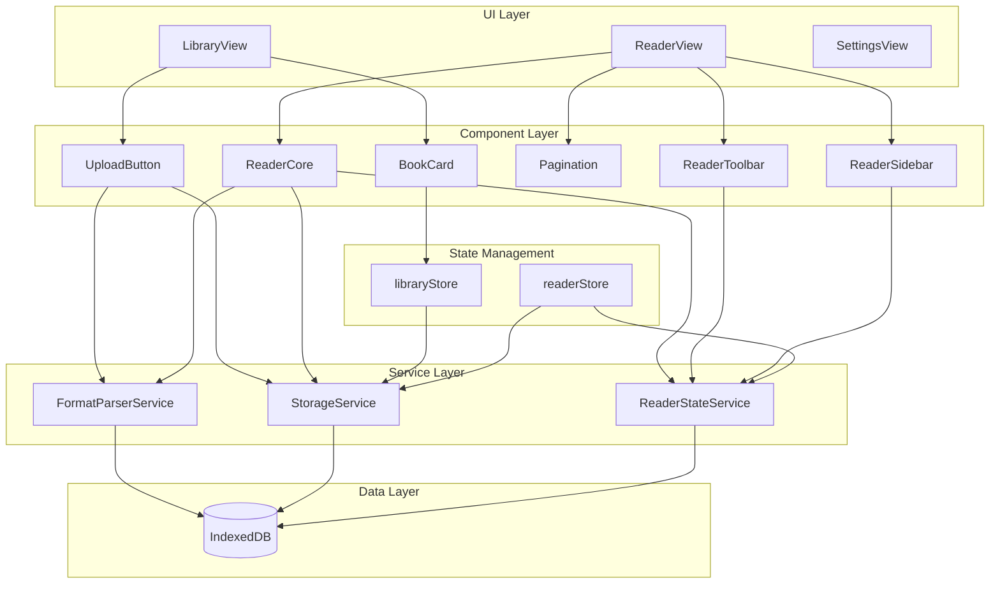
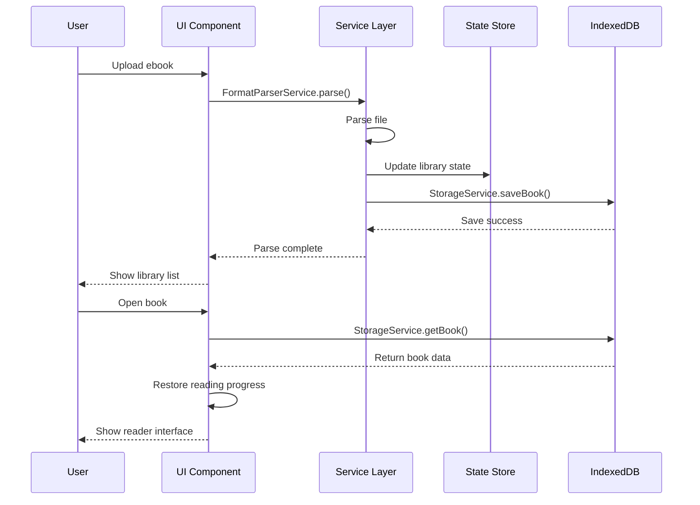

<div align="center">
  
</div>

<div align="center">

A web-based single-page ebook reader supporting multiple formats including TXT, PDF, EPUB, MOBI, DOCX, and Markdown.


[Online Demo](#online-demo) • [Features](#features) • [Tech Stack](#tech-stack) • [Quick Start](#quick-start) • [Project Structure](#project-structure) • [Developer Guide](#developer-guide)

</div>

---

## 📖 Introduction

Ebook Reader is a pure frontend single-page application that supports multiple ebook formats. All data is stored locally in browser OPFS (Origin Private File System), with automatic fallback to IndexedDB for unsupported browsers. No backend required, ensuring privacy. Can be packaged as a desktop app via Electron.
- Note: Since I am still pursuing a master's degree, I don't have much time, so there may not be much time to package the work, but the code will continue to be updated. If you find it useful, you can just use it directly. (Two versions have been released in the release section, welcome 🤗 to use and provide valuable feedback!)
- Some content is AI-generated, please verify carefully 🤭🤭

### Core Advantages

- **Fully Offline**: All data stored locally, no internet required
- **Multi-Format Support**: Covers mainstream ebook formats
- **Complete Features**: Bookmarks, notes, highlights, progress tracking
- **Lightweight & Fast**: Vite-powered, instant startup
- **Extensible**: Supports future desktop app packaging

---

## ✨ Features

### 📚 Library Management
- Upload local ebook files
- Grid/list view of all books
- Display cover, title, author, file size, reading time
- Delete books (cascade delete bookmarks and notes)
- **Magic Academy UI**: Immersive brand visuals on Home and Library pages

### 📖 Reading Experience
- Unified rendering for multiple formats
- Page navigation (prev/next)
- Reading progress display (percentage/page number)
- **TXT Live Info Bar**: Real-time clock and word count (read/total) at bottom-left, visible in both fullscreen and normal modes
- Responsive layout, adaptive to window size

### ⚙️ Personalized Settings
- **Font Size**: 5-level font size adjustment
- **Font Weight**: 5-level font weight (multi-layer shadow stacking, Windows optimized)
- **Theme Switch**: Light/Dark/Green mode
- **Reading Settings**: Line spacing, margins, font family

### 🔖 Bookmark Management
- Add bookmarks at any position
- Quick jump from bookmark list
- Customizable bookmark titles

### 📝 Notes & Highlights
- Select text to add notes
- Text highlighting
- Notes list management
- Click note to jump to original text

### 🖊️ PDF Features
- **Pen Annotation**: Canvas overlay with 6 colors, 0.5-10mm stroke width
- **Highlighter Annotation**: Semi-transparent painting effect, 4 fluorescent colors (yellow, green, pink, blue), 10-40px stroke width
- **Line Erase**: Swipe across annotation strokes to erase (segment distance detection)
- **Lasso Erase**: Draw a loop, ray-casting detection to batch erase annotations inside
- **Fullscreen**: Bottom-right floating button for one-click fullscreen toggle
- **Persistent Annotations**: Annotations visible even when toolbar is collapsed

### 💾 Progress Saving
- Auto-save reading progress
- Auto-jump to last position on reopen
- Independent progress per book


## 🛠️ Tech Stack

| Category | Technology | Version |
|----------|------------|---------|
| **Framework** | Vue 3 (Composition API) | 3.5.34 |
| **Language** | TypeScript | 5.x |
| **Build Tool** | Vite | 8.x |
| **Router** | Vue Router | 5.x |
| **State Management** | Pinia | 3.x |
| **UI Components** | Element Plus | 2.14 |
| **Data Storage** | OPFS (IndexedDB Fallback) | Native API |
| **Database Library** | Dexie.js (Fallback) | 4.4.2 |

### Format Parsing Libraries

| Format | Library |
|--------|---------|
| EPUB | epub.js |
| PDF | pdfjs-dist |
| DOCX | mammoth |
| Markdown | marked |
| TXT | Built-in parser |
| MOBI | Custom parser |

---

## 🚀 Quick Start

### Requirements

- Node.js 18+ 
- npm 9+
- Modern browser (Chrome, Edge, Firefox)

### Install Dependencies

```bash
cd workspace
npm install
```

### Development Mode

```bash
npm run dev
```

Open `http://localhost:5173` after startup.

### Production Build

```bash
npm run build
```

Build output directory: `dist/`

### Preview Production Build

```bash
npm run preview
```

---

## 📁 Project Structure

```
ebook-reader/
├── .monkeycode/              # Project specs and docs
│   ├── docs/                 # Documentation
│   │   ├── ARCHITECTURE.md   # Architecture design
│   │   ├── INTERFACES.md     # Interface definitions
│   │   └── DEVELOPER_GUIDE.md # Developer guide
│   └── specs/                # Feature specs
│       └── ebook-reader/
│           ├── requirements.md # Requirements
│           ├── design.md     # Technical design
│           └── tasklist.md   # Task list
├── public/                   # Static assets
│   ├── favicon.svg
│   └── icons.svg
├── src/
│   ├── assets/               # Assets (images, styles)
│   ├── components/           # Reusable components
│   │   ├── AppLayout.vue     # App layout
│   │   ├── BookGrid.vue      # Book grid
│   │   ├── Pagination.vue    # Pagination
│   │   ├── ReaderCore.vue    # Reader core
│   │   ├── ReaderSidebar.vue # Reader sidebar
│   │   ├── ReaderToolbar.vue # Reader toolbar
│   │   ├── SearchBar.vue     # Search bar
│   │   ├── Toast.vue         # Toast
│   │   └── UploadButton.vue  # Upload button
│   ├── router/               # Router config
│   │   └── index.ts
│   ├── services/             # Business logic layer
│   │   ├── parsers/          # Format parsers
│   │   │   ├── epubParser.ts
│   │   │   ├── pdfParser.ts
│   │   │   ├── docxParser.ts
│   │   │   ├── markdownParser.ts
│   │   │   ├── txtParser.ts
│   │   │   └── mobiParser.ts
│   │   ├── db.ts             # Database instance
│   │   ├── FormatParserService.ts # Parser service
│   │   └── StorageService.ts # Storage service
│   ├── stores/               # State management
│   │   ├── library.ts        # Library state
│   │   └── reader.ts         # Reader state
│   ├── types/                # TypeScript type definitions
│   │   └── index.ts
│   ├── utils/                # Utility functions
│   │   └── settings.ts
│   ├── views/                # Page components
│   │   ├── LibraryView.vue   # Library page
│   │   ├── ReaderView.vue    # Reader page
│   │   └── SettingsView.vue  # Settings page
│   ├── App.vue               # Root component
│   ├── main.ts               # Entry point
│   └── style.css             # Global styles
├── index.html                # HTML entry
├── package.json              # Dependencies
├── tsconfig.json             # TypeScript config
└── vite.config.ts            # Vite config
```

---

## 🏗️ Architecture

### System Architecture



### Data Flow



---

## 📋 Routes

| Route | Page | Description |
|-------|------|-------------|
| `/` | LibraryView | Library home |
| `/book/:id` | ReaderView | Reader page |
| `/settings` | SettingsView | Settings page |

---

## 💾 Data Storage

### Storage Solution

**Primary**: OPFS (Origin Private File System) - Browser native File System API

**Fallback**: IndexedDB (Dexie.js) - Automatic fallback when OPFS is unsupported

### OPFS Storage Structure

```
OPFS Root/
├── books/              # Book files
│   ├── {bookId}.json   # Book metadata
│   ├── {bookId}_raw    # Raw file (ArrayBuffer)
│   ├── {bookId}_cover  # Cover image (ArrayBuffer)
│   └── {bookId}_parsed.json  # Parsed content
├── bookmarks/          # Bookmarks
│   └── {bookId}.json
├── notes/              # Notes
│   └── {bookId}.json
├── progress/           # Reading progress
│   └── {bookId}.json
├── pdf-annotations/    # PDF annotations
│   └── {bookId}.json
└── settings.json       # Global settings
```

### IndexedDB Schema (Fallback)

Database name: `EbookReaderDB`

```typescript
{
  books: 'id, title, format, updatedAt',        // Book metadata
  parsedBooks: 'bookId',                        // Parsed content
  bookmarks: '++id, bookId, chapterId',         // Bookmarks
  notes: '++id, bookId, chapterId',             // Notes
  progress: 'bookId',                           // Reading progress
  settings: 'key'                               // User settings
}
```

### Data Export/Import

**Export**: Settings page → Export Data → Download JSON backup

**Import**: Settings page → Import Data → Select JSON file → Restore

**Backup File Format**:
```json
{
  "version": 1,
  "exportDate": "2026-05-23T...",
  "books": { ... },
  "parsedBooks": { ... },
  "bookmarks": { ... },
  "notes": { ... },
  "progress": { ... },
  "settings": { ... },
  "pdfAnnotations": { ... }
}
```

### Type Definitions

See [`src/types/index.ts`](src/types/index.ts)

- `ParsedBook`: Parsed ebook structure
- `BookRecord`: Book metadata record
- `BookmarkRecord`: Bookmark record
- `NoteRecord`: Note record
- `ProgressRecord`: Reading progress
- `ReaderSettings`: Reader settings

---

## 🔌 Core API

### FormatParserService

```typescript
// Parse ebook file
parse(file: File): Promise<ParsedBook>
```

### StorageService

```typescript
// Save book metadata
saveBook(book: BookRecord): Promise<void>

// Get book list
getBooks(): Promise<BookRecord[]>

// Delete book (cascade delete)
deleteBook(id: string): Promise<void>

// Save reading progress
saveProgress(progress: ProgressRecord): Promise<void>

// Get reading progress
getProgress(bookId: string): Promise<ProgressRecord | null>

// Add bookmark
addBookmark(bookmark: BookmarkRecord): Promise<void>

// Add note
addNote(note: NoteRecord): Promise<void>
```

---

## 🧪 Testing

```bash
# Type checking
npm run typecheck

# Build test
npm run build
```

---

## 📦 Deployment

### Static Deployment

Build output `dist/` can be deployed to any static hosting:

- Vercel
- Netlify
- GitHub Pages
- Cloudflare Pages

### Desktop App (Electron)

Package as desktop app via Electron:

```bash
# Install Electron
npm install -D electron electron-builder

# Build desktop app
npm run build
electron-builder
```

Output: `.exe` (Windows), `.dmg` (macOS), `.AppImage` (Linux)

---

## 🎯 Developer Guide

### Add New Format Support

1. Create new parser in `src/services/parsers/`
2. Implement `Parser` interface
3. Register in `FormatParserService`
4. Update supported formats list

### Add New Component

1. Create component in `src/components/`
2. Define Props types with TypeScript
3. Follow Vue 3 Composition API style
4. Export and import where needed

### State Management Guidelines

- Use Pinia Store for global state
- Use `ref`/`reactive` for local component state
- Avoid direct cross-Store access
- Service layer encapsulates complex business logic

---

## 📄 Documentation

- [Requirements](.monkeycode/specs/ebook-reader/requirements.md) - Functional requirements and acceptance criteria
- [Technical Design](.monkeycode/specs/ebook-reader/design.md) - Architecture and technical specs
- [Architecture](.monkeycode/docs/ARCHITECTURE.md) - System architecture details
- [Interfaces](.monkeycode/docs/INTERFACES.md) - API and type definitions
- [Developer Guide](.monkeycode/docs/DEVELOPER_GUIDE.md) - Development environment and standards

---

## 🔧 FAQ

### Q: Will my data be lost?

A: Data is stored in browser OPFS, which supports atomic writes and is more reliable than IndexedDB. However, clearing browser site data will still delete OPFS data. Consider using the **Export** feature to backup important books regularly.

### Q: What's the max file size supported?

A: OPFS typically supports 2GB+ storage space. Theoretically supports 50-100MB single files, subject to browser quota.

### Q: Can I use it on mobile?

A: Yes, the app uses responsive design and supports mobile browsers. Note that OPFS may not be supported in some mobile browsers and will automatically fallback to IndexedDB.

### Q: How to backup data?

A: Settings page → Click "Export Data" button → Download JSON backup file. To restore, click "Import Data" and select the backup file.

### Q: Does my browser support OPFS?

A: OPFS supports Chrome 102+, Edge 102+, Firefox 111+, Safari 17.4+. You can check the current storage method in the Settings page. Falls back to IndexedDB automatically if OPFS is unsupported.

---

## 📝 Changelog

### v0.6.0 (2026-05-28)

#### New Features
- **edge-tts-universal TTS Engine**: Migrated from browser SpeechSynthesis API to edge-tts-universal with WebSocket connection to Microsoft TTS service, no backend required
- **6 Chinese Voices**: Xiaoxiao, Xiaoyi, Yunjian, Yunxi, Yunxia, Yunyang with natural and fluent audio quality
- **Auto-scroll During Read Aloud**: Automatically tracks and scrolls to the current sentence position during reading
- **Enhanced Read Aloud Highlighting**: Current sentence highlight now includes rounded corners and shadow effects with theme adaptation

#### Improvements
- **TTS Pause Fix**: Clear audio callbacks before pausing to prevent auto-advancing to next sentence
- **Page Flip Mode Removed**: Removed page-flip reading mode, unified to scroll mode with only "Scroll" option in settings
- **Settings Panel Cleanup**: Removed line height text labels ("Super Wide"/"Standard" etc.) for cleaner interface
- **Favicon Update**: Replaced with transparent icon (no white border)
- **Theme Switch Fix**: Fixed CSS duplicate blocks causing theme switching issues
- **Auto Chapter Advance**: Read aloud automatically continues to next chapter when reaching chapter end

#### Removed
- Removed browser native SpeechSynthesis API (synthesis-failed issues)
- Removed Flask backend TTS service (edge-tts-universal runs directly in browser)
- Removed page flip mode related code and CSS
- Removed line height text label display

### v0.5.0 (2026-05-27)

#### New Features
- **Highlighter Tool**: New highlighter in annotation mode with semi-transparent painting effect, 4 fluorescent colors (yellow, green, pink, blue)
- **Toolbar Layout Optimization**: Reorganized annotation toolbar with clearer grouping (pen/highlighter/eraser)
- **Click Outside to Close**: Right side panels (Read Aloud, Shelf, Settings, etc.) now close when clicking blank area in reading area

#### Improvements
- **Reduced Toolbar Size**: Buttons, icons, and color dots unified to smaller sizes for a more compact UI
- **Highlighter Independent Width**: Highlighter uses pixel-level width (10-40px), separate from pen's millimeter-level width
- **Danger Color for Clear Button**: Clear All button turns red on hover for better warning

#### Removed
- Removed PDF text highlight feature (textLayer implementation had compatibility issues)

### v0.4.0 (2026-05-26)

#### New Features
- **Magic Academy UI**: Redesigned Home and Library pages with magic academy theme, enhanced brand text effects
- **QReader Rebrand**: Horizontal logo + brand name layout, transparent logo background, blue icon
- **PDF Fullscreen**: Fullscreen reading mode for PDF with bottom-right floating toggle button
- **TXT Reading Info Bar**: Floating bottom-left info bar with real-time clock and word count (words read / total words), visible in both fullscreen and normal modes
- **Theme Support**: Info bar adapts to all 4 themes (light, dark, green, parchment)

#### Improvements
- **PDF Fullscreen Button**: Unified bottom-right floating button across all formats
- **Zoom Controls**: Fixed white background in parchment mode, removed yellow box and divider line
- **Dark Mode**: Fixed fullscreen button blending into background
- Info bar font unified with chapter indicator (Georgia/Times New Roman, 14px, 500 weight)

#### Bug Fixes
- Fixed PDF range slider style override (WebKit/Firefox)
- Fixed compilation error (extra div closing tag)

### v0.3.0 (2026-05-25)

#### New Features
- **PDF Pen Annotation**: Canvas overlay with 6 colors, 0.5-10mm stroke width
- **Line Erase**: Swipe across annotation strokes to erase (segment distance detection)
- **Lasso Erase**: Draw a loop, ray-casting detection to batch erase annotations inside
- **Persistent Annotations**: Annotations visible even when toolbar is collapsed

#### Improvements
- **Font Weight 5-Level**: Multi-layer shadow stacking (4/6/8/12 layers), visible difference per level, Windows Microsoft YaHei optimized
- **TOC Panel Collapsed**: Table of contents panel collapsed by default for cleaner UI
- **Storage Refactor**: Switched to LocalStorage, isolated by file content hash
- **Erase Precision**: Segment distance replaces point-to-point distance for better hit detection
- **Coordinate Fix**: `screenX * canvas.width / rect.width` eliminates CSS zoom bias
- **Event Separation**: mouseleave only cleans up state for lasso mode, preventing false erases
- **Icon Redesign**: New icons for line erase, lasso erase, and clear all
- **Theme Cleanup**: Removed independent `.pdf-zoom-controls` background to avoid green box

#### Bug Fixes
- Fixed mouseleave triggering lasso erasure of out-of-loop annotations
- Fixed annotations disappearing when toolbar is collapsed
- Fixed `setTransform` parameter error
- Fixed missing `toggleReadAloud` function

### v0.2.0 (2026-05-23)

#### New Features
- **OPFS Storage**: Use Origin Private File System as primary storage, more reliable and secure
- **Data Export**: Export all data to JSON backup file
- **Data Import**: Restore data from JSON backup file
- **Storage Fallback**: Automatic fallback to IndexedDB for browsers without OPFS support
- **Storage Status**: Display current storage method in Settings page

#### Improvements
- **Data Migration**: Auto-migrate data from IndexedDB to OPFS on first use
- **Hybrid Storage Architecture**: StorageService supports both OPFS and IndexedDB modes
- **File-based Management**: Data stored as files, easier to backup and restore

### v0.1.0 (2026-05-16)

#### New Features
- **PDF Chapter Navigation**: Create chapter structure from PDF outline, click to jump to chapter start page
- **Page Indicator**: Display current chapter/page number for PDF
- **Pen Width Selection**: 5-level annotation pen width (1/2/3/4/6px)
- **Annotation Undo**: Undo last annotation or clear all annotations

#### Improvements
- **Eraser Refactor**: Fixed coordinate offset after zoom, real-time erase feedback
- **Toolbar Merge**: Combined annotation tools with zoom controls into single floating bar
- **PDF Parser Optimization**: Auto-chapter every 10 pages for PDFs without outline
- **Build Config**: Optimized Vite config with AllowedHosts for remote preview

#### Bug Fixes
- Fixed annotation coordinate calculation after PDF zoom
- Fixed annotation loss after refresh
- Fixed eraser coordinate system consistency
- Fixed TypeScript type definition errors

#### Removed
- Removed text selection highlight (focus on core reading experience, native PDF rendering)

### v0.0.0 (2026-05-13)

- Project initialization
- Basic architecture setup
- Type definitions and database design
- Core component development

---

## 🤝 Contributing

Issues and Pull Requests are welcome!

---

## 📄 License

MIT License

---

## 📮 Contact

- Repository: [GitHub](https://github.com/qiz7z/reader_v0)
- Issues: [Issue Tracker](https://github.com/qiz7z/reader_v0/issues)

---

<div align="center">

**Happy Reading!** 📚

If this project helps you, please give it a ⭐ Star

</div>
