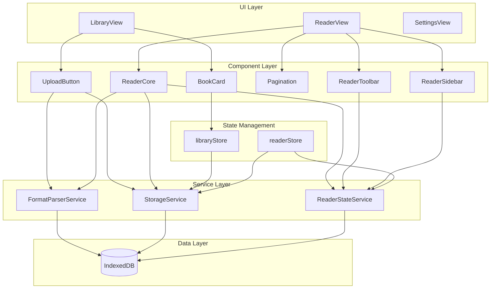
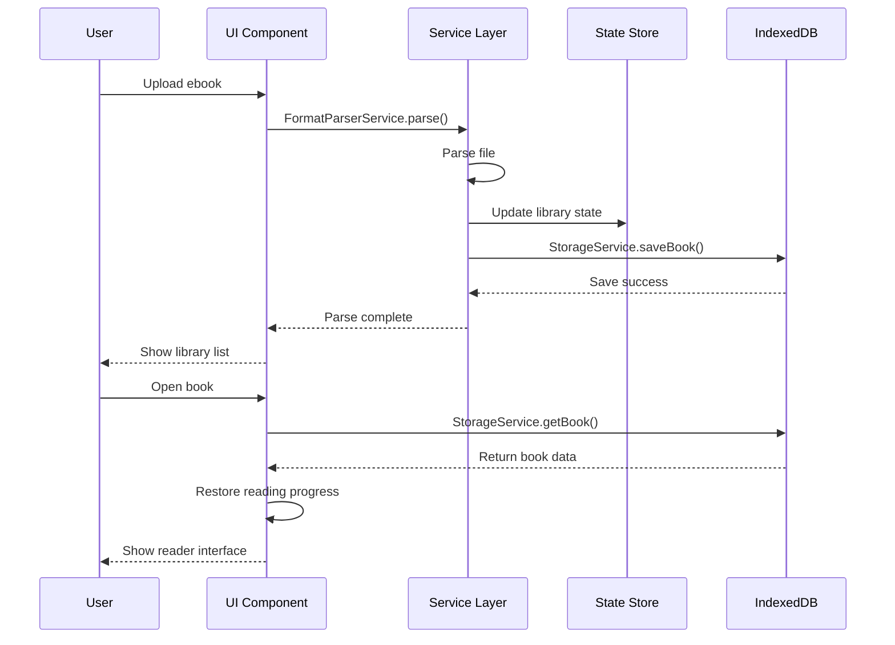

# Ebook Reader

<div align="center">

A web-based single-page ebook reader supporting multiple formats including TXT, PDF, EPUB, MOBI, DOCX, and Markdown.


[Online Demo](#online-demo) • [Features](#features) • [Tech Stack](#tech-stack) • [Quick Start](#quick-start) • [Project Structure](#project-structure) • [Developer Guide](#developer-guide)

</div>

---

## 📖 Introduction

Ebook Reader is a pure frontend single-page application that supports multiple ebook formats. All data is stored locally in browser IndexedDB - no backend required, ensuring privacy. Can be packaged as a desktop app via Electron.

### Core Advantages

- **Fully Offline**: All data stored locally, no internet required
- **Multi-Format Support**: Covers mainstream ebook formats
- **Complete Features**: Bookmarks, notes, highlights, progress tracking
- **Lightweight & Fast**: Vite-powered, instant startup
- **Extensible**: Supports future desktop app packaging

---

## ✨ Features

### 📚 Library Management
- Upload local ebook files
- Grid/list view of all books
- Display cover, title, author, file size, reading time
- Delete books (cascade delete bookmarks and notes)

### 📖 Reading Experience
- Unified rendering for multiple formats
- Page navigation (prev/next)
- Reading progress display (percentage/page number)
- Responsive layout, adaptive to window size

### ⚙️ Personalized Settings
- **Font Size**: 5-level font size adjustment
- **Theme Switch**: Light/Dark/Green mode
- **Reading Settings**: Line spacing, margins, font family

### 🔖 Bookmark Management
- Add bookmarks at any position
- Quick jump from bookmark list
- Customizable bookmark titles

### 📝 Notes & Highlights
- Select text to add notes
- Text highlighting
- Notes list management
- Click note to jump to original text

### 💾 Progress Saving
- Auto-save reading progress
- Auto-jump to last position on reopen
- Independent progress per book

### 📄 PDF Features (NEW in v0.1.0)
- **Chapter Navigation**: Jump to chapter start from PDF outline/table of contents
- **Page Indicator**: Display current chapter/page number
- **Pen Width Selection**: 5-level annotation pen width (1/2/3/4/6px)
- **Annotation Undo**: Undo last annotation or clear all annotations
- **Eraser Improvement**: Real-time erase feedback with fixed coordinate offset

---

## 🛠️ Tech Stack

| Category | Technology | Version |
|----------|------------|---------|
| **Framework** | Vue 3 (Composition API) | 3.5.34 |
| **Language** | TypeScript | 5.x |
| **Build Tool** | Vite | 8.x |
| **Router** | Vue Router | 5.x |
| **State Management** | Pinia | 3.x |
| **UI Components** | Element Plus | 2.14 |
| **Data Storage** | Dexie.js (IndexedDB) | 4.4.2 |

### Format Parsing Libraries

| Format | Library |
|--------|---------|
| EPUB | epub.js |
| PDF | pdfjs-dist |
| DOCX | mammoth |
| Markdown | marked |
| TXT | Built-in parser |
| MOBI | Custom parser |

---

## 🚀 Quick Start

### Requirements

- Node.js 18+ 
- npm 9+
- Modern browser (Chrome, Edge, Firefox)

### Install Dependencies

```bash
cd workspace
npm install
```

### Development Mode

```bash
npm run dev
```

Open `http://localhost:5173` after startup.

### Production Build

```bash
npm run build
```

Build output directory: `dist/`

### Preview Production Build

```bash
npm run preview
```

---

## 📁 Project Structure

```
ebook-reader/
├── .monkeycode/              # Project specs and docs
│   ├── docs/                 # Documentation
│   │   ├── ARCHITECTURE.md   # Architecture design
│   │   ├── INTERFACES.md     # Interface definitions
│   │   └── DEVELOPER_GUIDE.md # Developer guide
│   └── specs/                # Feature specs
│       └── ebook-reader/
│           ├── requirements.md # Requirements
│           ├── design.md     # Technical design
│           └── tasklist.md   # Task list
├── public/                   # Static assets
│   ├── favicon.svg
│   └── icons.svg
├── src/
│   ├── assets/               # Assets (images, styles)
│   ├── components/           # Reusable components
│   │   ├── AppLayout.vue     # App layout
│   │   ├── BookGrid.vue      # Book grid
│   │   ├── Pagination.vue    # Pagination
│   │   ├── ReaderCore.vue    # Reader core
│   │   ├── ReaderSidebar.vue # Reader sidebar
│   │   ├── ReaderToolbar.vue # Reader toolbar
│   │   ├── SearchBar.vue     # Search bar
│   │   ├── Toast.vue         # Toast
│   │   └── UploadButton.vue  # Upload button
│   ├── router/               # Router config
│   │   └── index.ts
│   ├── services/             # Business logic layer
│   │   ├── parsers/          # Format parsers
│   │   │   ├── epubParser.ts
│   │   │   ├── pdfParser.ts
│   │   │   ├── docxParser.ts
│   │   │   ├── markdownParser.ts
│   │   │   ├── txtParser.ts
│   │   │   └── mobiParser.ts
│   │   ├── db.ts             # Database instance
│   │   ├── FormatParserService.ts # Parser service
│   │   └── StorageService.ts # Storage service
│   ├── stores/               # State management
│   │   ├── library.ts        # Library state
│   │   └── reader.ts         # Reader state
│   ├── types/                # TypeScript type definitions
│   │   └── index.ts
│   ├── utils/                # Utility functions
│   │   └── settings.ts
│   ├── views/                # Page components
│   │   ├── LibraryView.vue   # Library page
│   │   ├── ReaderView.vue    # Reader page
│   │   └── SettingsView.vue  # Settings page
│   ├── App.vue               # Root component
│   ├── main.ts               # Entry point
│   └── style.css             # Global styles
├── index.html                # HTML entry
├── package.json              # Dependencies
├── tsconfig.json             # TypeScript config
└── vite.config.ts            # Vite config
```

---

## 🏗️ Architecture

### System Architecture



### Data Flow



---

## 📋 Routes

| Route | Page | Description |
|-------|------|-------------|
| `/` | LibraryView | Library home |
| `/book/:id` | ReaderView | Reader page |
| `/settings` | SettingsView | Settings page |

---

## 💾 Data Storage

### IndexedDB Schema

Database name: `EbookReaderDB`

```typescript
{
  books: 'id, title, format, updatedAt',        // Book metadata
  parsedBooks: 'bookId',                        // Parsed content
  bookmarks: '++id, bookId, chapterId',         // Bookmarks
  notes: '++id, bookId, chapterId',             // Notes
  progress: 'bookId',                           // Reading progress
  settings: 'key'                               // User settings
}
```

### Type Definitions

See [`src/types/index.ts`](src/types/index.ts)

- `ParsedBook`: Parsed ebook structure
- `BookRecord`: Book metadata record
- `BookmarkRecord`: Bookmark record
- `NoteRecord`: Note record
- `ProgressRecord`: Reading progress
- `ReaderSettings`: Reader settings

---

## 🔌 Core API

### FormatParserService

```typescript
// Parse ebook file
parse(file: File): Promise<ParsedBook>
```

### StorageService

```typescript
// Save book metadata
saveBook(book: BookRecord): Promise<void>

// Get book list
getBooks(): Promise<BookRecord[]>

// Delete book (cascade delete)
deleteBook(id: string): Promise<void>

// Save reading progress
saveProgress(progress: ProgressRecord): Promise<void>

// Get reading progress
getProgress(bookId: string): Promise<ProgressRecord | null>

// Add bookmark
addBookmark(bookmark: BookmarkRecord): Promise<void>

// Add note
addNote(note: NoteRecord): Promise<void>
```

---

## 🧪 Testing

```bash
# Type checking
npm run typecheck

# Build test
npm run build
```

---

## 📦 Deployment

### Static Deployment

Build output `dist/` can be deployed to any static hosting:

- Vercel
- Netlify
- GitHub Pages
- Cloudflare Pages

### Desktop App (Electron)

Package as desktop app via Electron:

```bash
# Install Electron
npm install -D electron electron-builder

# Build desktop app
npm run build
electron-builder
```

Output: `.exe` (Windows), `.dmg` (macOS), `.AppImage` (Linux)

---

## 🎯 Developer Guide

### Add New Format Support

1. Create new parser in `src/services/parsers/`
2. Implement `Parser` interface
3. Register in `FormatParserService`
4. Update supported formats list

### Add New Component

1. Create component in `src/components/`
2. Define Props types with TypeScript
3. Follow Vue 3 Composition API style
4. Export and import where needed

### State Management Guidelines

- Use Pinia Store for global state
- Use `ref`/`reactive` for local component state
- Avoid direct cross-Store access
- Service layer encapsulates complex business logic

---

## 📄 Documentation

- [Requirements](.monkeycode/specs/ebook-reader/requirements.md) - Functional requirements and acceptance criteria
- [Technical Design](.monkeycode/specs/ebook-reader/design.md) - Architecture and technical specs
- [Architecture](.monkeycode/docs/ARCHITECTURE.md) - System architecture details
- [Interfaces](.monkeycode/docs/INTERFACES.md) - API and type definitions
- [Developer Guide](.monkeycode/docs/DEVELOPER_GUIDE.md) - Development environment and standards

---

## 🔧 FAQ

### Q: Will my data be lost?

A: Data is stored in browser IndexedDB. Clearing browser cache will cause data loss. Consider exporting important books regularly (feature planned for future version).

### Q: What's the max file size supported?

A: Theoretically limited by browser IndexedDB quota, typically supports 50-100MB files.

### Q: Can I use it on mobile?

A: Yes, the app uses responsive design and supports mobile browsers.

### Q: How to backup data?

A: Future version will support export/import feature. Currently you can export IndexedDB data via browser DevTools.

---

## 📝 Changelog

### v0.1.0 (2026-05-16)

#### New Features
- **PDF Chapter Navigation**: Create chapter structure from PDF outline, click to jump to chapter start page
- **Page Indicator**: Display current chapter/page number for PDF
- **Pen Width Selection**: 5-level annotation pen width (1/2/3/4/6px)
- **Annotation Undo**: Undo last annotation or clear all annotations

#### Improvements
- **Eraser Refactor**: Fixed coordinate offset after zoom, real-time erase feedback
- **Toolbar Merge**: Combined annotation tools with zoom controls into single floating bar
- **PDF Parser Optimization**: Auto-chapter every 10 pages for PDFs without outline
- **Build Config**: Optimized Vite config with AllowedHosts for remote preview

#### Bug Fixes
- Fixed annotation coordinate calculation after PDF zoom
- Fixed annotation loss after refresh
- Fixed eraser coordinate system consistency
- Fixed TypeScript type definition errors

#### Removed
- Removed text selection highlight (focus on core reading experience, native PDF rendering)

### v0.0.0 (2026-05-13)

- Project initialization
- Basic architecture setup
- Type definitions and database design
- Core component development

---

## 🤝 Contributing

Issues and Pull Requests are welcome!

---

## 📄 License

MIT License

---

## 📮 Contact

- Repository: [GitHub](https://github.com/qiz7z/reader_v0)
- Issues: [Issue Tracker](https://github.com/qiz7z/reader_v0/issues)

---

<div align="center">

**Happy Reading!** 📚

If this project helps you, please give it a ⭐ Star

</div>
